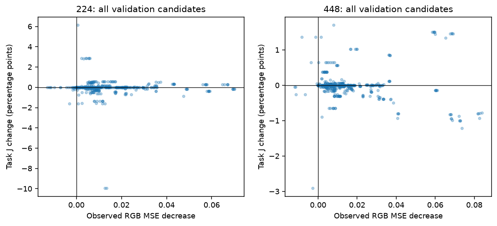
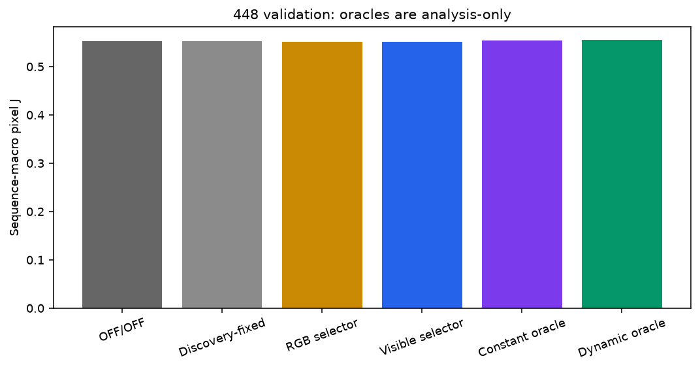
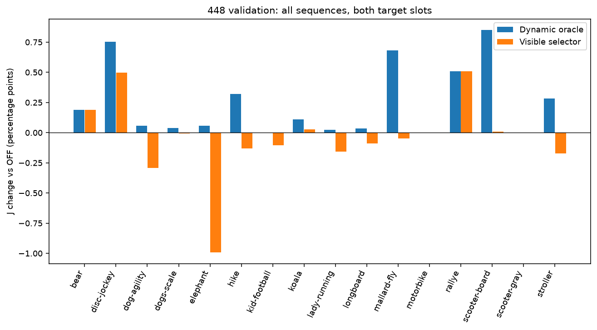

# Opportunity 与部署可见信号实验

H1=STRONG；H2=NOT_ESTABLISHED。完整性=PASS；测试=PASS。

主指标为原始像素空间的对象平均 J，再对两个 target slots 和 sequence 分层等权平均。F 是二值边界近似次指标，JF=(J+F)/2 仅为该近似的算术汇总；这里没有 DAVIS 官方 J&F 成绩。

本轮 validation 重用了历史内部 validation 的16个序列，属于新协议下锁定重评，不是全新独立 holdout；本轮正式读取发生在科学代码、配置与selector锁定之后。reserve 与 DAVIS 官方 validation 应保持封存，审计结果见 STATUS.md / integrity.json。

原始 candidate 行数=1792；448 validation 序列=16、pairs=32；每pair完整16条two-step轨迹。所有target slots参与聚合。

## 十二个问题

1. 高分辨率评价是否改变旧结论？224 的 oracle−OFF 为 0.003865，448 为 0.002451 [0.001173, 0.003934]。两种输入都重新提取 DINO patch；448 是真实 32×32 特征网格，并非插值 16×16 结果。这里只能直接比较本轮重评，不能把旧 token IoU 与当前 pixel J 当同一指标。

2. 有益写入是否跨样本存在？448 共 18 个正收益 pair、14 个正收益 sequence；14 个 pair 持平、0 个更差。H1=STRONG。oracle 含 OFF，故非负本身不构成有效性证明。

3. 是否被单个序列支配？最大贡献来自 scooter-board，top-1=0.217017，top-3=0.583927；scooter-board 占 0.217017。去掉任意一个 sequence 的最小 oracle gain=0.002047。所有 sequence 均保留。

4. 动态顺序是否优于 constant oracle？dynamic−constant=0.000750 [0.000065, 0.001891]；正收益 pair=8，独立 sequence=7。零增益不能称为需要动态顺序。

5. 多少样本需要非恒定轨迹？严格超过全部四种 constant 轨迹的 pair=8；按固定 tie-break 选出非恒定 oracle 的 pair=13。后者可能包含并列最优，不能替代前者。

6. RGB 与任务收益是否对齐？全部448 validation候选的 RGB decrease 与 ΔJ：Pearson=-0.076289、Spearman=-0.188402。散点保留全部候选；相关性是描述性结果，同一图像候选不独立，不代表因果证据。

7. 哪些信号最相关？按 validation 的 |Spearman| 回顾性排序：feature_cosine: ρ=0.258447, r=0.025274, AUROC=0.493669, AP=0.262166; feature_drift: ρ=-0.257258, r=-0.066209, AUROC=0.507888, AP=0.289811; feature_large_change_fraction: ρ=-0.243106, r=-0.083842, AUROC=0.498849, AP=0.272420; rgb_relative_decrease: ρ=-0.238238, r=-0.070954, AUROC=0.498962, AP=0.267162; probe_relative_decrease: ρ=-0.230252, r=-0.070623, AUROC=0.505850, AP=0.267941。这是离线诊断排序，不用于重选特征、方向或阈值；完整 discovery/validation 对比见 signal_analysis.json。

8. RGB-only 是否有效？J=0.552181，相对 OFF=-0.000496 [-0.002155, 0.000952]；write rate=1.000000，有害写入占已写入 pair 的比例=0.531250。阈值仅在 discovery 调整，其 tuning reward 不是独立泛化估计。

9. visible selector 是否有实际收益？J=0.552207；相对 OFF=-0.000470 [-0.002144, 0.000997]，相对 discovery-fixed=-0.000273 [-0.000520, -0.000076]；H2=NOT_ESTABLISHED。只按锁定分析标准判断，不因为捕获了个别正例就声称整体有效。

10. 捕获多少机会？positive capture=0.368248，净 ΔJ=-0.000470；写入率=0.906250，有害写入率（分母为写入 pair）=0.551724，precision=0.275862，recall=0.444444。正收益 capture 不扣除损害，必须结合净收益看。

11. 当前瓶颈？当前候选家族至少存在局部机会；若选择器未获正净收益，证据更指向机会识别不足。极小收益仍可能同时反映更新家族偏弱，不能仅凭相关性定因。 尺度分桶审计：large: n_objects=18, ΔJ=0.002539; medium: n_objects=24, ΔJ=0.001432; small: n_objects=11, ΔJ=0.003889; tiny: n_objects=11, ΔJ=0.000000；非 tiny 对象宏平均 gain=0.003425。这不足以排除其他表示或读出限制。

12. 下一阶段最小实验？保持当前原始结果与阈值不变。在新的预注册实验中，用未曾观察的新独立序列先复核机会量级；若机会稳定但当前选择器失败，只在 discovery 比较一个预先限定的信号/写入子空间对照，再锁定一次评估。不得把本轮 validation 继续用于调参，也不在本轮开启 reserve 或 DAVIS 官方 validation。

## 统一方法比较

| 方法 | J | F（近似） | JF（近似） | ΔJ vs OFF：sequence bootstrap 95% CI |
|---|---:|---:|---:|---|
| OFF/OFF | 0.552677 | 0.544773 | 0.548725 | 0.000000 [0.000000, 0.000000] |
| Discovery-fixed | 0.552480 | 0.546987 | 0.549733 | -0.000198 [-0.001772, 0.001216] |
| RGB selector | 0.552181 | 0.545551 | 0.548866 | -0.000496 [-0.002155, 0.000952] |
| Visible selector | 0.552207 | 0.545215 | 0.548711 | -0.000470 [-0.002144, 0.000997] |
| Constant oracle | 0.554378 | 0.549720 | 0.552049 | 0.001701 [0.000604, 0.003024] |
| Dynamic oracle | 0.555129 | 0.551293 | 0.553211 | 0.002451 [0.001173, 0.003934] |

区间用 sequence 为单位配对重采样，保留每个序列全部 pairs；10,000次、固定seed。pair bootstrap仅作补充，候选/特征检验没有多重比较校正。J/F/JF与STATUS数值采用0..1比例；绝对J差值乘100才是百分点。

部署候选选择也有成本：当前实现每pair试算全部16条two-step轨迹，共32次proposal调用、64次A/B增量计算，并执行16个候选可见RGB读出与特征对应计算。这里未做匹配计算预算的效率对照，不能宣称动态选择更省计算。

## 分布、量化与机制审计

Oracle ΔJ：pair mean=0.002451、median=0.000124、std=0.004712、min/max=0.000000/0.017023。≥0.5/1/2百分点pair计数：{'0.005': 6, '0.01': 4, '0.02': 0}。轨迹熵=2.628517 nats；并列oracle按分数计数，完整频数/sequence偏好/size偏好保存在 oracle_analysis.json。

令冻结RGB decoder为 D∈R^(64×3)，support RGB residual为 R∈R^(N×3)，归一化激活为 X̃∈R^(N×64)。单步增量满足 ΔW = η/(N‖D‖²_F) · D Rᵀ X̃（实现含数值clamp与标量范数裁剪）；因此 rank(ΔW)≤3，列空间属于col(D)。固定D的多步相加仍留在同一列空间。A/B组合后整体特征变换需区别于单步矩阵；该限制不证明它就是任务收益瓶颈。

数值审计记录=7168；最大numerical rank=3；最大decoder-span residual=2.470e-07。各步A/B奇异值、秩与span记录及rank/norm对gain相关性见 rank_analysis.json；阈值abs=1e-08、relative=1e-05。

## 可复现性与审计边界

config.json、split_manifest.json、preregistration.json与锁定artifact记录配置和来源。fit只拟合PCA/whitening/RGB decoder；ridge只在discovery拟合，标准化位于LOSO训练折内。validation选择先于target mask读取；是否满足此约束以独立integrity.json为准，缺失时明确PENDING。

工作产物目录：`outputs/EXP-2D-20260926-opportunity-selector-v1`。完整测试结果：`tests.json`（458 passed, 1 skipped in 15.93s）。完整从头运行的 `commands.sh` 仅用于新的干净工作副本，会拒绝覆盖已有实验。当前目录请运行 `regenerate.sh` 从封存raw重新生成分析，再运行独立 `scripts/report_opportunity_probe.py --report-dir ... --work-dir ...` 生成本报告与图片。报告阶段不读取数据集、不重新训练选择器、不使用validation调整任何配置。

后处理与独立审计各发生一次原生进程崩溃（exit139，原因未确诊）；启用faulthandler及单线程数值库后重试成功，全部分析逐字节一致。科学代码、raw、阈值未变，validation未重跑。详情见postprocessing_incident.json。
