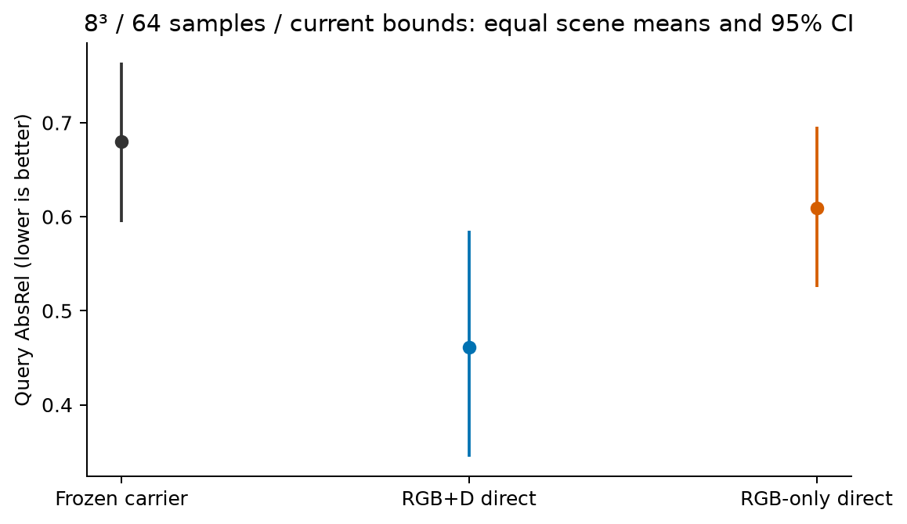
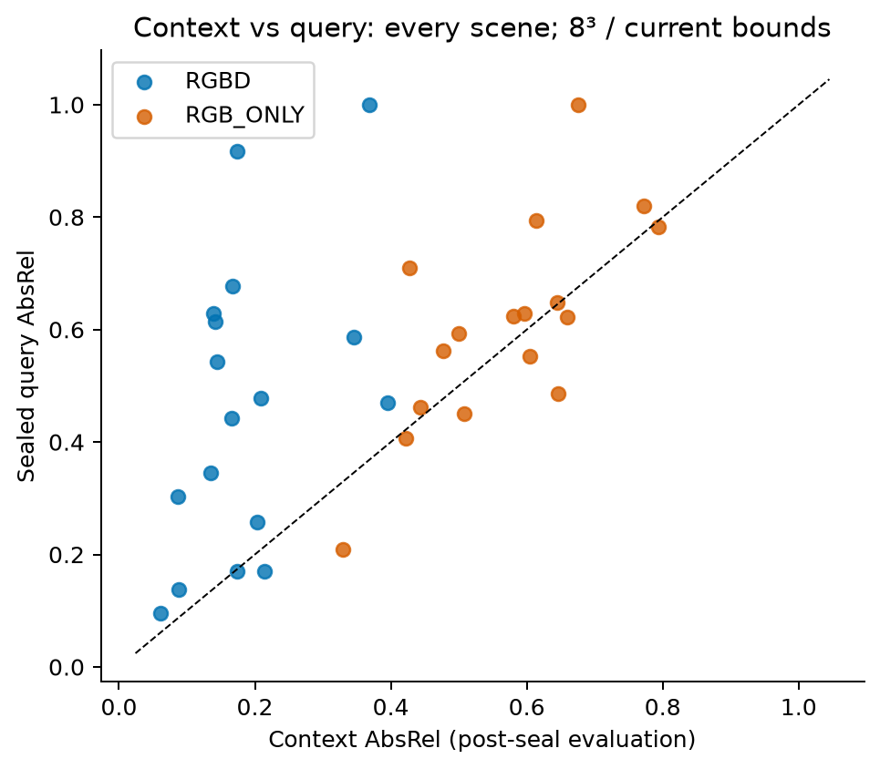
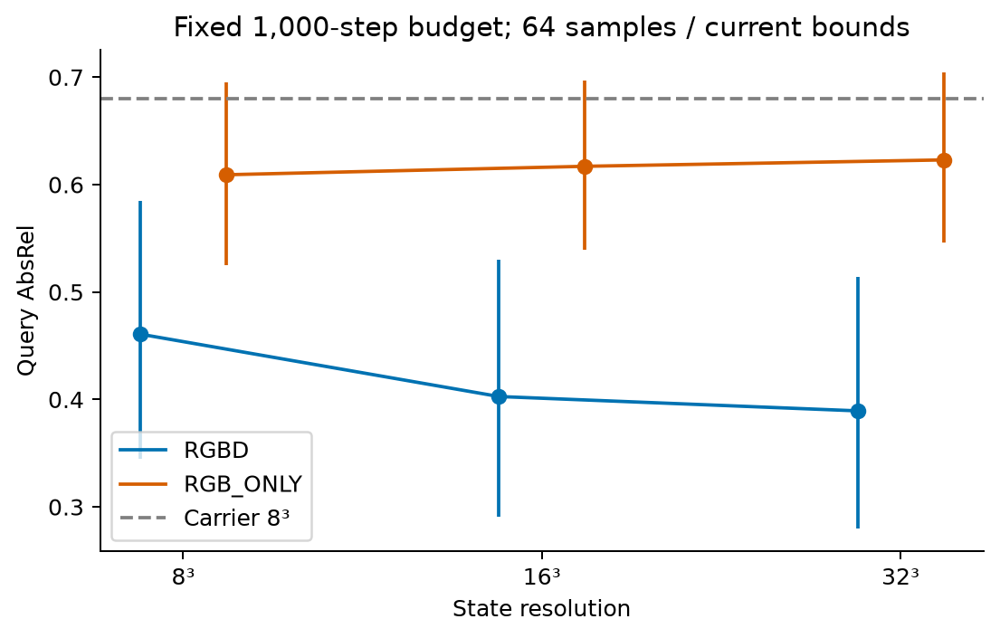
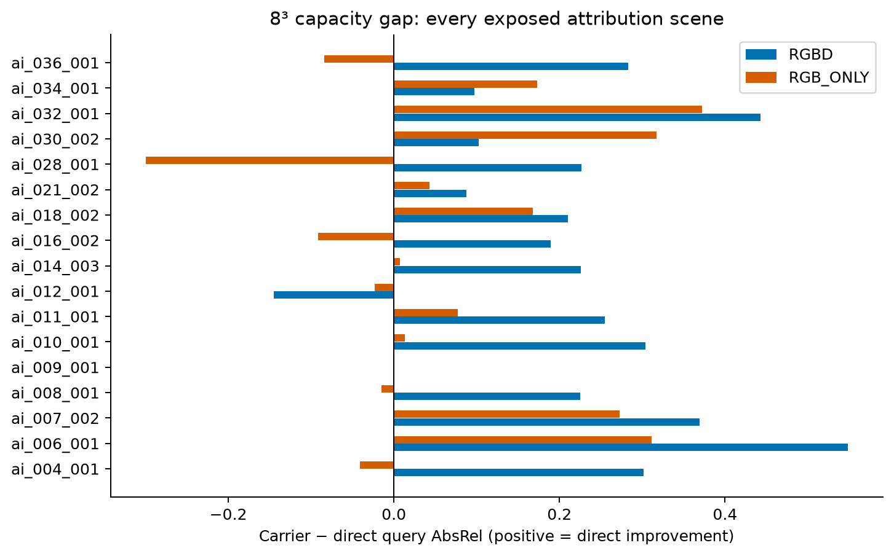
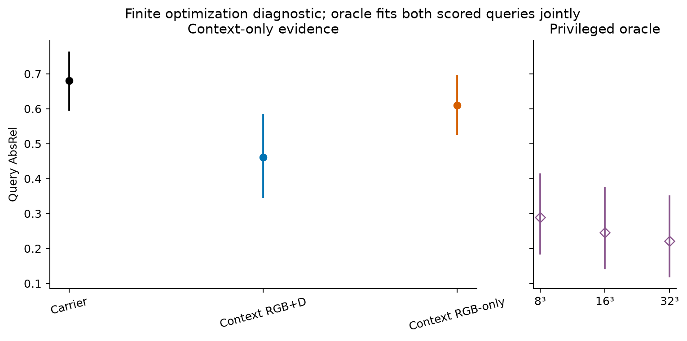
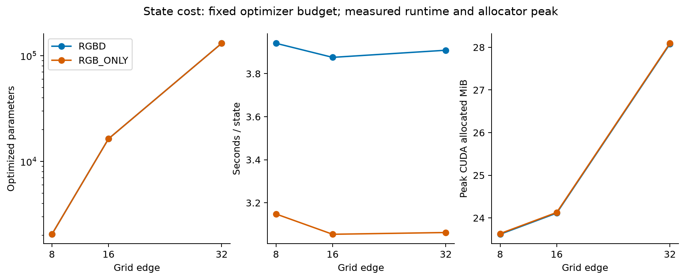

# EXP-3D-DIRECT-STATE-CAPACITY-V1

`STATE_CAPACITY_STATUS=RESOLUTION_LIMITED`。17 个已曝光场景上的归因实验，**不是独立验证或方法资格确认**。425 个 direct states（340 context-only，85 query-supervised diagnostic），固定原 renderer，无新 carrier 训练、writer、Dynamic TTT 或 holdout 评价。


## 十二个研究问题的回答

结论是：**检测到 RGB+D 的 8³→16³ 分辨率瓶颈，但尚未建立“当前 shared state 已充分、只需重训 learner”的资格。** Bounds、context 恢复和优化充分性仍影响解释。下列判断使用已冻结的规则；没有把更有利的 bounds 或高 grid 事后改成主要配置。

1. **8³ + fixed renderer 能否表示正确 geometry？** 在主配置 CURRENT_BOUNDS 下尚未建立充分性。8³ context RGB+D 的 query AbsRel 为 0.460804，未达到预注册工程门槛。明确特权的 query-supervised oracle 在相同主配置下也未过完整门槛，但它不是数学最优解，不能据此判定表示天生无能。后述预定 bounds 敏感性说明这个判断有条件性。

2. **Query-supervised direct state 能做到什么水平？——仅诊断。** CURRENT 的 8³/16³/32³ oracle AbsRel 分别为 0.289314/0.246014/0.221586；三者 ≤0.35 的场景数仅 11/17、11/17、12/17，因此均未通过“mean≤.25 且至少75%场景≤.35”的完整条件。预先定义的替代 bounds 下，8³ oracle 为 0.202158，15/17 场景≤.35，达到该工程条件。这说明不能脱离 bounds 笼统否定8³表示；该组仍是用了query GT的诊断，不是泛化结果。

3. **Context RGB+D 达到什么水平？** 8³为0.460804，16³为0.402736，32³为0.389382。相对旧carrier确有改善，但绝对query误差仍高；不能把“比差基线好”直接写成容量已经充分。

4. **RGB-only 达到什么水平？** 8³为0.609175；16³/32³为0.617032/0.622991，没有随着grid增大而改善。8³相对carrier改善的CI跨零，也未稳定优于anchor。它在context上的RGB MSE很低，但depth AbsRel仍为0.570093，说明本配置下颜色拟合不能替代几何恢复。这不证明所有RGB-only信号或优化方法都不可能有效。

5. **Carrier与direct gap多大？** 主配置8³，RGB+D capacity gap为 **+0.219022 [0.142366, 0.292736]**；RGB-only为 **+0.070651 [−0.011010, 0.151245]**。前者有强的可达改善证据，但使用额外context depth，不能把整个gap全归于RGB-only learner没学会。RGB+D相对旧anchor的gap为+0.123797 [0.066338, 0.179595]。

6. **改善是否跨多个场景？** RGB+D对carrier为15改善/1持平/1更差；LOSO均值区间[0.198443,0.241792]全正。最大单场景占正收益14.17%，前三占35.16%，不是一个scene独占。RGB-only为10改善/1持平/6更差，稳定性明显不足。全部17场景保留，没有移除零ray-hit或不利场景。

7. **分辨率提高是否稳定改善？** RGB+D 8→16收益 **+0.058068 [0.028670,0.091763]**，13改善/1持平/3更差，满足冻结稳定性门槛。16→32只有+0.013353 [−0.004395,0.032370]，不满足。`RESOLUTION_LIMITED`来自前一项证据，不表示32³必要，也不表示分辨率是唯一原因。

8. **Renderer samples重要吗？** 在预定64/128范围内没有实用收益：8³的64→128 gain为−0.000304，16³为−0.000099，CI均跨零；没有支持把ray采样数视为主要瓶颈。这个结论只覆盖该采样对照，不能排除renderer表示语义或其他结构性限制。

9. **是否只是记住context？** RGB+D 8³的context AbsRel=0.188866，query=0.460804，gap=+0.271937 [0.168836,0.381501]，明显存在context→query缺口，不能宣称已经形成充分可复用的状态。但它也有跨场景的query改善和wrong-scene损害证据，不能简化为完全只有记忆。RGB-only的depth gap虽小，却是context与query的depth都差，不是几何泛化成功。

10. **Wrong-scene是否损害direct？** RGB+D 8³的损害为+0.100210 [0.043297,0.160697]，说明同一query camera下，正确场景状态携带了有用信息。RGB-only损害为+0.022024 [−0.057422,0.094209]，未稳定建立。Shuffle/density-only/color-only/zero均实际渲染评分，原状态保持不变。

11. **主要瓶颈在哪里？** 预注册标签是`RESOLUTION_LIMITED`；纯learner失败、纯renderer-sampling失败和充分容量均未建立。8³的context RGB+D−oracle gap仍有+0.171489 [0.099124,0.254048]，但CURRENT oracle8未过good gate，所以不能将主标签事后改为CONTEXT_INFERENCE_LIMITED。该未触发标记也不是排除context信息/恢复困难。CURRENT中仅62.19%的query GT点在bounds内，37.81%的有效GT ray-distance超过AABB far；替代bounds后分别为71.21%和28.57%，仍不充分。全部425/425状态都选择第1000步，且最后三次目标仍下降；因此实验测到的是固定预算下的可达水平，不能当成表达上限；目标下降也可能来自正则，不能保证继续增加步骤会改善query。

12. **下一轮具体做什么？** 选择**16³作为下一阶段高分辨率carrier设计的候选**，先单独预注册优化充分性与固定GT-free bounds对照，确认context恢复的剩余差距，再决定是否进入matched carrier训练，以及是否必须显式采用depth/geometry inference。暂不直接升32³、增加renderer samples、扩大当前8³训练或停止整个representation路线。本轮没有执行新carrier训练，也没有开启final holdout。

以上是归因证据及下一阶段设计建议，不是严格因果分解，也不是对独立测试集的确认。


## 主要结果：context-only

下表均为 scene 等权 query 指标；A/B 先各自平均 query，再等权平均，最后平均 17 个场景。AbsRel/RMSE/RGB MSE 越低越好，δ1/SSIM 越高越好。Opacity/coverage 不是任务质量本身。

| 方法 | AbsRel [95% CI] | RMSE | δ1 | RGB MSE | SSIM | Opacity | Coverage |
| --- | --- | --- | --- | --- | --- | --- | --- |
| Frozen carrier A/B | 0.679826 [0.594255, 0.763765] | 4.241166 | 0.114208 | 0.135283 | 0.250842 | 0.804630 | 0.924688 |
| Frozen anchor | 0.584600 [0.482711, 0.684995] | 3.928339 | 0.172762 | 0.150035 | 0.258841 | 0.560766 | 0.927875 |
| Fixed analytic prior | 0.581239 [0.438343, 0.752266] | 2.785235 | 0.362424 | 0.129532 | 0.260030 | 1.000000 | 1.000000 |
| Direct RGB+D 8³ | 0.460804 [0.344466, 0.584858] | 3.219391 | 0.323563 | 0.069713 | 0.336619 | 0.798473 | 0.927875 |
| Direct RGB-only 8³ | 0.609175 [0.524933, 0.695391] | 4.005957 | 0.129102 | 0.074977 | 0.337788 | 0.568168 | 0.927875 |

RGB+D 使用 context depth，不能把它单独优于 RGB-only carrier 的差值全部归因于 learner。RGB-only 优化阶段不加载本场景 depth；其 context depth 指标由封存后的 evaluator 另行测量。Coverage 定义为预测 opacity > 1e-6，不能称为真实可见率。

| 比较（正值为 direct 改善） | 平均 [95% CI] | 中位数 | 改善/持平/更差 | LOSO 范围 | 正收益 top1 / top3 占比 |
| --- | --- | --- | --- | --- | --- |
| capacity_gap_RGBD_g8 | 0.219022 [0.142366, 0.292736] | 0.225564 | [15, 1, 1] | [0.19844345612111275, 0.24179158389931588] | [0.1417243724254989, 0.3515862672594697] |
| capacity_gap_RGB_ONLY_g8 | 0.070651 [-0.011010, 0.151245] | 0.013605 | [10, 1, 6] | [0.0518011799323263, 0.09381287646448691] | [0.2119566271387663, 0.5699259100788818] |
| anchor_gap_RGBD_g8 | 0.123797 [0.066338, 0.179595] | 0.134948 | [14, 1, 2] | [0.10907660203548068, 0.13845427720164602] | [0.1594650939740802, 0.4034648311141586] |
| anchor_gap_RGB_ONLY_g8 | -0.024575 [-0.105874, 0.059186] | -0.017838 | [6, 1, 10] | [-0.047969569342041454, -0.006365487889028371] | [0.3950230908958278, 0.9287860808413912] |

Capacity gap = carrier − direct；anchor gap = frozen anchor − direct。完整七项 direct − carrier 配对差值另见 capacity_analysis.json；误差指标负值表示 direct 更好。统计采用 10,000 次 scene-paired bootstrap，seed 20260927、95% percentile CI、tie=1e-8。所有诊断 CI 未做多重比较校正；分组均值的 CI 不等同于差值 CI。完整 LOSO、正/绝对贡献 top1/top3、逐场景值均保存在 JSON。

## 分辨率、renderer 和 bounds


| 轨道 | grid | Query AbsRel [95% CI] | Context AbsRel | Query RGB MSE |
| --- | --- | --- | --- | --- |
| RGBD | 8 | 0.460804 [0.344466, 0.584858] | 0.188866 | 0.069713 |
| RGBD | 16 | 0.402736 [0.290399, 0.529700] | 0.142550 | 0.066665 |
| RGBD | 32 | 0.389382 [0.279618, 0.513778] | 0.118879 | 0.067303 |
| RGB_ONLY | 8 | 0.609175 [0.524933, 0.695391] | 0.570093 | 0.074977 |
| RGB_ONLY | 16 | 0.617032 [0.539618, 0.696698] | 0.587285 | 0.083236 |
| RGB_ONLY | 32 | 0.622991 [0.545688, 0.704208] | 0.600645 | 0.077098 |

| 相邻 grid 改善（旧误差−新误差） | 平均 [95% CI] | 改善/持平/更差 |
| --- | --- | --- |
| resolution_RGBD_16_to_32 | 0.013353 [-0.004395, 0.032370] | [11, 1, 5] |
| resolution_RGBD_8_to_16 | 0.058068 [0.028670, 0.091763] | [13, 1, 3] |
| resolution_RGB_ONLY_16_to_32 | -0.005960 [-0.017658, 0.006177] | [6, 1, 10] |
| resolution_RGB_ONLY_8_to_16 | -0.007856 [-0.023438, 0.007567] | [6, 1, 10] |

| RGBD grid | 64 samples AbsRel | 128 samples AbsRel | 64→128 改善 [95% CI] |
| --- | --- | --- | --- |
| 8 | 0.460804 | 0.461108 | -0.000304 [-0.000787, 0.000001] |
| 16 | 0.402736 | 0.402835 | -0.000099 [-0.000406, 0.000152] |

主 sweep 始终固定 64 samples、相同场景/帧/损失/步数；128 samples 是单独预定的 RGBD 8³/16³ 对照。改变 samples 也改变优化梯度，因此这仍是受控诊断，不能声称纯粹的因果分解。

| 8³ bounds 敏感性 | CURRENT AbsRel | 替代 bounds AbsRel | 误差改善 [95% CI] | CURRENT GT inside / ray hit / GT>far | 替代 GT inside / ray hit / GT>far |
| --- | --- | --- | --- | --- | --- |
| RGBD | 0.460804 | 0.398010 | 0.062793 [-0.009556, 0.154074] | 0.621875 / 0.927875 / 0.378100 | 0.712058 / 0.941176 / 0.285651 |
| RGB_ONLY | 0.609175 | 0.617360 | -0.008185 [-0.077807, 0.063734] | 0.621875 / 0.927875 / 0.378100 | 0.712058 / 0.941176 / 0.285651 |

CURRENT 为 [-6,-4,-6] 到 [6,4,6]；替代规则仅取 context camera rays 的训练集全局深度 q01/q99 端点，AABB 两侧各扩 5%，最小边长 1m。训练 prior near=0.214252m、far=5.672045m，来自原 TRAIN3 frame12..15；不读取 capacity query camera/GT 构造 bounds。RGB-only 的该敏感性组含训练集全局 depth 先验。GT inside/far 诊断只在封存后计算，未用于改 bounds 或选配置。

## Context 泛化与状态结构对照


| 轨道 | Context AbsRel | Query AbsRel | Query−context [95% CI] | Context RGB MSE | Query RGB MSE |
| --- | --- | --- | --- | --- | --- |
| RGBD | 0.188866 | 0.460804 | 0.271937 [0.168836, 0.381501] | 0.038017 | 0.069713 |
| RGB_ONLY | 0.570093 | 0.609175 | 0.039082 [-0.015788, 0.100450] | 0.030634 | 0.074977 |

| 8³ CURRENT 对照 | 轨道 | AbsRel damage [95% CI] | 对照 RGB MSE | 对照 opacity |
| --- | --- | --- | --- | --- |
| wrong_scene | RGBD | 0.100210 [0.043297, 0.160697] | 0.200303 | 0.831709 |
| spatial_shuffle | RGBD | 0.230732 [0.117220, 0.334972] | 0.158724 | 0.421910 |
| density_only | RGBD | 0.000000 [0.000000, 0.000000] | 0.128908 | 0.798473 |
| color_only | RGBD | 0.171633 [0.065131, 0.271722] | 0.109659 | 0.518394 |
| zero_density_color | RGBD | 0.539196 [0.415142, 0.655534] | 0.264531 | 0.000000 |
| wrong_scene | RGB_ONLY | 0.022024 [-0.057422, 0.094209] | 0.206407 | 0.591451 |
| spatial_shuffle | RGB_ONLY | 0.095526 [0.054977, 0.132148] | 0.129440 | 0.438869 |
| density_only | RGB_ONLY | 0.000000 [0.000000, 0.000000] | 0.105305 | 0.568168 |
| color_only | RGB_ONLY | 0.023261 [-0.032922, 0.079970] | 0.106211 | 0.518394 |
| zero_density_color | RGB_ONLY | 0.390825 [0.304609, 0.475067] | 0.264531 | 0.000000 |

Damage = 对照误差 − 正确 direct-state 误差。Wrong scene 使用排序后下一个场景的同配置状态，recipient query camera 不变。Shuffle 对 density/color 使用同一置换；density-only 将 color 固定 .5；color-only 将 density logits 固定 −2；zero 为 logits−100/color0。以上均评价实际渲染预测，不以 latent 差异代替任务结果；raw 每行另含 RGB/depth 预测 RMS/max变化与 camera/state hashes。

## DIAGNOSTIC ORACLE：有 query 监督的表达诊断

仅在全部 context-only 状态完成、封存并评价之后开启。每个 oracle state 同时优化两张 query，二者共享同一状态；不是每张 query 拟合一份。不能作为部署方法、泛化证据或数学最优上界。

| Grid | Oracle query AbsRel [95% CI] | RGBD context-direct − oracle [95% CI] | Oracle RGB MSE |
| --- | --- | --- | --- |
| 8 | 0.289314 [0.182400, 0.415307] | 0.171489 [0.099124, 0.254048] | 0.049936 |
| 16 | 0.246014 [0.140091, 0.376902] | 0.156722 [0.095687, 0.224654] | 0.039560 |
| 32 | 0.221586 [0.117433, 0.352675] | 0.167796 [0.108980, 0.232165] | 0.031324 |

Oracle bounds sensitivity (8³, both queries jointly supervised): 0.202158 [0.115965, 0.324988]; CURRENT minus alternative AbsRel: 0.087157 [0.023183, 0.162853]. This is privileged diagnostic evidence only.

三层分别是 query-supervised direct（L1）、context-supervised direct（L2）、learned carrier（L3）。L1→L2 可能同时涉及 context 信息、可见性、inverse problem 与优化目标；L2→L3 可能涉及构建和训练，但 RGBD 额外监督也在其中。不能把这些差值当成严格因果分解。

## 全部场景


| Scene | Carrier | RGBD8 | RGB-only8 | Capacity gap RGBD | Capacity gap RGB-only |
| --- | --- | --- | --- | --- | --- |
| ai_004_001 | 0.779260 | 0.477407 | 0.820523 | 0.301853 | -0.041264 |
| ai_006_001 | 0.718085 | 0.169801 | 0.406857 | 0.548284 | 0.311228 |
| ai_007_002 | 0.982847 | 0.613777 | 0.710292 | 0.369069 | 0.272554 |
| ai_008_001 | 0.767661 | 0.542372 | 0.782645 | 0.225289 | -0.014984 |
| ai_009_001 | 1.000000 | 1.000000 | 1.000000 | 0.000000 | 0.000000 |
| ai_010_001 | 0.607138 | 0.302940 | 0.593533 | 0.304199 | 0.013605 |
| ai_011_001 | 0.725612 | 0.470586 | 0.648408 | 0.255026 | 0.077204 |
| ai_012_001 | 0.771186 | 0.916472 | 0.794587 | -0.145286 | -0.023401 |
| ai_014_003 | 0.569939 | 0.344375 | 0.562523 | 0.225564 | 0.007416 |
| ai_016_002 | 0.359323 | 0.170133 | 0.451121 | 0.189189 | -0.091798 |
| ai_018_002 | 0.796167 | 0.585848 | 0.628220 | 0.210319 | 0.167947 |
| ai_021_002 | 0.529628 | 0.442072 | 0.486331 | 0.087557 | 0.043297 |
| ai_028_001 | 0.322961 | 0.096067 | 0.622903 | 0.226894 | -0.299942 |
| ai_030_002 | 0.779558 | 0.676903 | 0.462110 | 0.102656 | 0.317448 |
| ai_032_001 | 0.580974 | 0.138157 | 0.208729 | 0.442816 | 0.372245 |
| ai_034_001 | 0.726362 | 0.629328 | 0.553077 | 0.097034 | 0.173285 |
| ai_036_001 | 0.540342 | 0.257425 | 0.624119 | 0.282917 | -0.083778 |

## 优化定义与真实成本

直接优化 density logits 与 sigmoid-bounded RGB，4g³ 个参数；log-variance 固定−3，features/evidence/appearance=None。没有 query-conditioned network。沿用原 fixed renderer 的归一化 ray direction、metric ray-distance depth=sum(w·t)，不除 opacity，RGB background=0。Adam LR=.03、1000步、每步1024个完整128×160 context像素均匀有放回抽样、clip=1。RGB MSE + RGBD 的 valid-depth AbsRel + 1e-5 mean(softplus(z)²) + 1e-4 mean physical-spacing TV(density,color)。每100步及step0全监督像素评估目标，选最小值，严格小于才更新保证最早tie；context-only没有query早停。

小 pilot 只用 ai004001/A context：两轨 RGB loss 均下降，RGBD depth loss 下降，梯度非零、输出改变、没有 NaN/inf 或全0/全1 opacity。随后冻结 formal protocol，未因 query 结果改参数。

| Track | Grid | 参数 | 优化秒/state | Peak allocated MiB | Peak reserved MiB | query render秒/frame | 选中1000步 |
| --- | --- | --- | --- | --- | --- | --- | --- |
| RGBD | 8 | 2048 | 3.941236 | 23.617676 | 36.000000 | 0.005531 | 34/34 |
| RGBD | 16 | 16384 | 3.875900 | 24.113281 | 36.000000 | 0.005600 | 34/34 |
| RGBD | 32 | 131072 | 3.909008 | 28.078125 | 42.000000 | 0.005591 | 34/34 |
| RGB_ONLY | 8 | 2048 | 3.147925 | 23.633301 | 36.000000 | 0.005161 | 34/34 |
| RGB_ONLY | 16 | 16384 | 3.053720 | 24.128906 | 36.000000 | 0.006207 | 34/34 |
| RGB_ONLY | 32 | 131072 | 3.061837 | 28.093750 | 42.000000 | 0.006126 | 34/34 |

425 个状态中 425 个选中预算边界，425 个最后三次目标仍呈下降趋势。完整 full-objective 曲线、last3 slope、selected checkpoint 和每10步 trace 均保留。1000步不是全局收敛证明；高grid比8³有64倍参数，同步数不代表同等优化充分性。

GPU 为 RTX5090，PyTorch2.11.0+cu128。优化秒数不含数据加载和checkpoint落盘；renderer秒数不含GT读取、指标和NPZ压缩，CUDA同步后计时。VRAM为本进程allocator峰值，不是整机显存；共享GPU环境并非独占性能基准。第144个状态曾发生一次进程segfault，143份完整状态hash复核后保留，仅lock的未完成尝试另存audit，按相同冻结配置/seed重跑并完成；未观察query后挑选重跑。不能声称已定位该环境崩溃的根因。

## 判定与下一阶段

预注册 engineering-good：mean AbsRel≤.25 且至少75%场景≤.35；stable practical gain：mean≥.02、配对CI下界>0、至少75%场景不变差。这是预先声明的工程标准，不是官方benchmark。

```json
{
  "CONTEXT_INFERENCE_BOTTLENECK": false,
  "DYNAMIC_TTT_RUN": false,
  "FINAL_HOLDOUT_TOUCHED": false,
  "LEARNER_TRAINING_BOTTLENECK": false,
  "NEW_CARRIER_TRAINED": false,
  "RENDERER_BOTTLENECK": false,
  "REPRESENTATION_BOTTLENECK": "NOT_ESTABLISHED_BY_FINITE_OPTIMIZATION",
  "RESOLUTION_BOTTLENECK": true,
  "STATE_CAPACITY_STATUS": "RESOLUTION_LIMITED",
  "engineering_good": {
    "QUERY_ORACLE8": false,
    "RGBD8": false,
    "RGB_ONLY8": false
  },
  "limitations": [
    "Exposed attribution scenes, not independent qualification",
    "RGBD depth is privileged; this gap alone cannot identify RGB-only learner failure",
    "Finite optimization and bounds limitations preclude proving expressivity impossible",
    "Evidence flags and unadjusted diagnostic CIs are not strict causal attribution"
  ],
  "next_stage_recommendations_only": [
    "Design a separate higher-resolution carrier study with optimization controls"
  ],
  "renderer_comparison_rule": "largest stable renderer mean gain > largest RGBD grid mean gain",
  "sufficient_rgbd_evidence": false
}
```

不因有限优化下 oracle 较差就证明 state 无法表达；bounds/ray reach、优化剩余空间都必须先排除。本轮只给下一阶段建议，不开展新 carrier 训练或开启 protected holdout。

## 审计、复现与交付

冻结 B-final SHA256=`be7b8b6d2ef366cad245732b9ff227802db596da65082ac0e160f24541579e42`。从 checkpoint 重建51个context状态hash全同；136条 A/B/anchor/prior 查询预测与旧结果完全相同。旧产物3523项保持不变，其中2695项freshhash，828项受保护媒体只比较size/mtime并引用以前验证的SHA，本轮未重新读取其字节。

context loader剥离query帧及其相机，RGB-only再移除depth路径；优化器只接收允许的 ObservationBatch。管理用manifest含原始锁定元数据，这不是OS级文件访问隔离。baseline是已曝光旧状态的独立重放，允许在formal direct优化前评分；direct评价先要求全部340完成，CPU clone/hash封存后才读取query媒体（包括哈希读取）。oracle作为明确特权阶段单列。GT访问、seal事件、phase完成记录、输入/source/state哈希及文件时间辅助证据完整保存；mtime不具防篡改保证。

完整suite：717 passed、1 skipped，Ruff PASS；跳过项仅可选历史V5 step4500 checkpoint未分发。46项新增direct-capacity核心测试覆盖loader隔离、原renderer预测及梯度一致、选择规则、同状态多query、wrong-camera、场景bootstrap及raw统计复算。另有归档I/O测试。所有正式query预测NPZ逐条重算7指标通过，context/oracle行数分别 1360 / 170；统计另行从raw重算比对。

从仓库根目录运行：

```bash
bash outputs/EXP-3D-DIRECT-STATE-CAPACITY-V1/commands.sh analyze outputs/direct-capacity-reanalysis
bash outputs/EXP-3D-DIRECT-STATE-CAPACITY-V1/commands.sh reproduce outputs/direct-capacity-reproduction
.venv/bin/python scripts/analyze_direct_capacity.py --root docs/experiments/EXP-3D-DIRECT-STATE-CAPACITY-V1 --output outputs/direct-capacity-docs-only-analysis
```

第一/三条仅使用raw与数值摘要，不加载权重或媒体；第三条直接读取报告中的gzip。第二条复用已冻结pilot协议/历史baseline，在新目录重做425份状态，需要原数据路径及冻结源码。CUDA fresh optimization未承诺跨设备逐bit相同；保存预测→指标、保存raw→统计分别经过完整审计。全部.pt与预测NPZ在本地outputs，报告目录提供425-state索引、压缩raw/audit、源码快照、配置和六幅PNG/SVG，不把大权重冒充已在Git发布。当前工作未git commit/push。

## 图表













