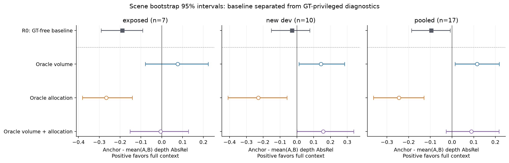

# EXP-3D-SUPPORT-BOTTLENECK-REDESIGN-V1

本轮已完成封存、重新生成旧统计、新数据锁定/下载、四组静态oracle归因、回归测试和独立审计。
**SUPPORT_BOTTLENECK_STATUS=INCONCLUSIVE；STATIC_STATE_STATUS=NOT_ESTABLISHED。**
按预先冻结的联合oracle停止规则，没有执行实景GT-free redesign、matched retraining或final holdout。
没有训练controller，没有新Dynamic TTT、FC/CF、history或写入调参。

## 先读结论与限制

Volume确实影响结果：oracle volume单独使同设置下的full-context gain为+0.115349，
scene-bootstrap CI [0.014210,0.217646]。但这不等于完整预测变好了0.115349或0.210574。
R0完整context AbsRel=0.679826，oracle volume=0.645657，绝对改善仅
**0.034169**（CI [−0.070911,+0.135352]）；anchor则从
0.584600变差到0.761006。
相对gain增加0.210574的代数分解中，约**83.8%来自anchor变差**，不是支持机制的因果贡献率。
完整context的绝对任务收益及其CI另见 `audit/scientific_interpretation.json`。

联合oracle pooled gain=+0.089622，
CI [-0.026782,
+0.216702]，
不满足在看结果前锁定的继续门槛。其表面邻域支持仅66.22%，未达75%充分性标准，
因此不能声称“理想支持已经提供，仍然失败，所以一定是网络/训练问题”。
当前8³离散表达、支持定义及训练分布耦合仍未分离。

## 身份、冻结和数据

旧1000A+600B B-final SHA256：`be7b8b6d2ef366cad245732b9ff227802db596da65082ac0e160f24541579e42`。
旧实验987个文件完整封存；旧3场景234行、旧7场景182行（含Residual A/B）统计精确复算，
160帧volume/support核对通过。新runner中的旧7场景R0五个方法70行与上一轮逐项精确一致。
旧7场景从本轮起统一为 **REDESIGN_DEV_EXPOSED**，不再作为独立泛化证据。

新锁定24个不同官方source volume/archive/asset候选，按合法scene名顺序交替12 DEV、12 HOLDOUT。
只使用Hypersim official-train与research-train；不打开官方validation/protected/test。
下载220,495,946字节，全部bounded HTTP range。10个DEV、8个HOLDOUT通过预先固定的质量和native
geometry阈值；失败候选保留、不替换、不跨角色移动。初始身份锁 `scene_role_lock.json` 未覆盖，
具体合格帧角色另锁在 `qualified_frame_role_lock.json`。本轮实际归因共7 exposed+10 new DEV场景。

**Holdout独立性尚未成立。** ai027001/ai033001有项目旧100scene池曝光标记，其他候选也无法仅凭
不在旧100池就排除后续365scene扩展的使用；缺少逐场景历史执行日志。它们未参加当前B-final训练、
不在旧7场景内，但不能据此声称项目历史“从未见过/未调过”。全部holdout在本轮没有模型前向或query
score，保持保护，`FINAL_HOLDOUT_INDEPENDENCE_STATUS=INDEPENDENCE_UNRESOLVED`。
即便未来某方法过开发gate，也必须先解决此独立性阻塞。这里的8仅指几何合格数。

## 方法合同与oracle例外

固定网络权重、8³状态、128唯一candidate IDs、固定renderer64samples及原context/query列表。
ORACLE_VOLUME用全部primary query GT surface在anchor坐标中的包围盒，最小轴长1m并加5%边距；
同场景A/B/anchor共享该bounds。ORACLE_SUPPORT在当前bounds的512合法voxel centers中选128个，
优先≥2 context frusta，然后到context GT表面的距离，再view count与ID稳定排序；联合设置只组合
这两个因素。points、normalized_xyz、scatter IDs和bounds同步；没有偷偷增加候选或网络。

这是**固定网格内的有GT诊断，不是数学upper bound，也不保证物理上完美表面支持**。
候选的≥2计数仅是camera frustum membership，不等于遮挡正确的表面可见性。
R0先封存；oracle为构造bounds必须在自身封存前读取query GT geometry，日志明确标记
`PRESEAL_DIAGNOSTIC_EXCEPTION`。所有评分RGB/depth在全部204 states封存后读取。
Oracle状态对锁定query集合有条件，绝不称部署时query-independent；query cameras在wrong-scene
替换时数值不变。参数合同指出这些同shape运行时干预仍改变训练分布，不能当作公平训练后的新方法。

主表采用query均值→scene等权，10,000 paired scene bootstrap、seed20260927、95%percentile CI。
Full-context gain=anchor−mean(A,B)，wrong-scene damage=cyclic donor A−correct A；
donor在各cohort内轮换。
17场景pooled和7/10分层统计同时保留，不把旧7重新包装成独立确认。

## DIAGNOSTIC UPPER BOUNDS（名义诊断，非保证的上界）

| 设置 | 完整context AbsRel↓ | Anchor AbsRel↓ | Full-context gain及95%CI | Wrong-scene damage及95%CI |
|---|---:|---:|---:|---:|
| ORACLE_VOLUME | 0.645657 | 0.761006 | +0.115349 [+0.014210, +0.217646] | +0.118054 [-0.062877, +0.296401] |
| ORACLE_SUPPORT | 0.829626 | 0.584600 | -0.245025 [-0.361812, -0.129884] | +0.004498 [-0.130065, +0.139508] |
| ORACLE_VOLUME_SUPPORT | 0.671384 | 0.761006 | +0.089622 [-0.026782, +0.216702] | +0.049533 [-0.057264, +0.162221] |


## DEPLOYABLE METHODS

| 设置 | 完整context AbsRel↓ | Anchor AbsRel↓ | Full-context gain及95%CI | Wrong-scene damage及95%CI |
|---|---:|---:|---:|---:|
| R0 | 0.679826 | 0.584600 | -0.095226 [-0.186745, -0.008134] | -0.010613 [-0.143138, +0.126179] |


R1 adaptive-volume、R2 camera-overlap allocation、R3 camera-only context selection、R12/R123：
**NOT_RUN_ORACLE_STOP，结果为null。** 三类几何原型及隔离测试已实现；没有实景运行、近远深度
先验调优或按分数选方法。Matched current/redesigned两条训练和train-scale-up均未启动，
不存在“最佳新carrier”。这些空项不是0分或失败训练的伪造结果。

## 支持、集中度与完整任务指标

| 设置 | GT surface inside | ≥2-view candidates | GT surface支持邻域 | 正/平/负场景数 |
|---|---:|---:|---:|---|
| R0 | 62.1875% | 7.9733% | 12.2089% | 5/1/11 |
| ORACLE_VOLUME | 100.0000% | 58.3180% | 47.3295% | 11/0/6 |
| ORACLE_SUPPORT | 62.1875% | 31.9393% | 45.9308% | 3/1/13 |
| ORACLE_VOLUME_SUPPORT | 100.0000% | 93.1756% | 66.2190% | 11/0/6 |


主要表面支持距离固定为1.172604m（旧voxel半对角线），避免扩大volume后自动扩大容差。
同时保存各新voxel尺度下的描述性邻域数，不能替代固定半径主诊断。
联合oracle inside=100%、two-view=93.18%，但surface-neighborhood=66.22%＜75%，充分性失败。
Volume-only和联合各11/17场景gain为正；联合gain的正贡献top1≈25.7%、top3≈64.8%。
所有LOSO、集中度、每场景完整结果和描述性support/gain相关都在 `bootstrap_results.json`。
相关不建立因果。相同候选数并不意味着相同物理voxel分辨率，所有bounds/extent保存在raw计划中。

| 设置/读取 | RGB MSE↓ | SSIM↑ | RMSE↓ | δ1↑ | Opacity | Coverage |
|---|---:|---:|---:|---:|---:|---:|
| R0/A | 0.124564 | 0.248801 | 4.393755 | 0.075277 | 0.787104 | 0.921502 |
| R0/B | 0.146002 | 0.252883 | 4.088577 | 0.153139 | 0.822156 | 0.927875 |
| R0/anchor | 0.150035 | 0.258841 | 3.928339 | 0.172762 | 0.560766 | 0.927875 |
| R0/prior | 0.129532 | 0.260030 | 2.785235 | 0.362424 | 1.000000 | 1.000000 |
| R0/wrong_scene | 0.172166 | 0.239375 | 4.410057 | 0.087276 | 0.762365 | 0.886064 |
| ORACLE_VOLUME/A | 0.170234 | 0.162357 | 4.197707 | 0.143716 | 0.857150 | 0.983864 |
| ORACLE_VOLUME/B | 0.150020 | 0.197251 | 3.897104 | 0.121579 | 0.875222 | 0.989143 |
| ORACLE_VOLUME/anchor | 0.185900 | 0.258458 | 4.246628 | 0.096906 | 0.360484 | 1.000000 |
| ORACLE_VOLUME/prior | 0.129532 | 0.260030 | 2.785235 | 0.362424 | 1.000000 | 1.000000 |
| ORACLE_VOLUME/wrong_scene | 0.222346 | 0.149528 | 4.573596 | 0.105320 | 0.685200 | 0.848449 |
| ORACLE_SUPPORT/A | 0.177435 | 0.152083 | 4.976671 | 0.033241 | 0.895316 | 0.904787 |
| ORACLE_SUPPORT/B | 0.186863 | 0.162416 | 4.858382 | 0.049508 | 0.894087 | 0.909226 |
| ORACLE_SUPPORT/anchor | 0.150035 | 0.258841 | 3.928339 | 0.172762 | 0.560766 | 0.927875 |
| ORACLE_SUPPORT/prior | 0.129532 | 0.260030 | 2.785235 | 0.362424 | 1.000000 | 1.000000 |
| ORACLE_SUPPORT/wrong_scene | 0.237776 | 0.153206 | 4.970473 | 0.031479 | 0.898094 | 0.911477 |
| ORACLE_VOLUME_SUPPORT/A | 0.195914 | 0.124432 | 4.361059 | 0.079528 | 0.960270 | 0.990957 |
| ORACLE_VOLUME_SUPPORT/B | 0.190852 | 0.148420 | 4.385323 | 0.082307 | 0.949296 | 0.984493 |
| ORACLE_VOLUME_SUPPORT/anchor | 0.185900 | 0.258458 | 4.246628 | 0.096906 | 0.360484 | 1.000000 |
| ORACLE_VOLUME_SUPPORT/prior | 0.129532 | 0.260030 | 2.785235 | 0.362424 | 1.000000 | 1.000000 |
| ORACLE_VOLUME_SUPPORT/wrong_scene | 0.227053 | 0.138223 | 4.304179 | 0.101150 | 0.766762 | 0.857716 |


Coverage仍为opacity>1e-6，不是真实可见性；所有GT-valid像素均参与depth指标，未按预测opacity筛掉
坏像素。Oracle volume也改变ray integration范围与anchor prior；没有证据证明正relative gain完全
独立于opacity/coverage。由于没有方法达到最终gate，不做静态资格成功宣称。

## 停止规则与12个归因问题

1. **主要来自volume、candidate还是representation？** Volume有直接干预证据，但不是充分解释；
   candidate-only恶化相对gain，联合不稳定。representation/训练/分辨率尚未被独立隔离。
2. **Oracle volume alone恢复多少？** pooled gain +0.115349；相对R0 gain提升+0.210574，但完整context
   绝对AbsRel只改善0.034169，83.8%的相对提升来自anchor变差。
3. **Oracle support alone恢复多少？** gain −0.245025，较R0更差0.149800；
   frustum支持提升不等于任务收益。
4. **Volume+support恢复多少？** gain +0.089622，较R0增加0.184847，但CI跨零；完整context绝对改善仅
   0.008442，不能称静态carrier获救。
5. **GT-free volume恢复多少？** 未运行，遵守联合oracle停止条件，不能填oracle成绩。
6. **Camera-overlap allocation恢复多少？** 未运行；候选几何原型/预算测试可用。
7. **Context geometry selection恢复多少？** 未运行；camera-only确定性和输入隔离测试可用。
8. **哪个因素贡献最大？** 这些冻结权重诊断中volume对relative gain的改变最大；这是干预分解，不是
   对全部失败的因果占比，也不是部署收益。
9. **支持修复后full context终于优于anchor？** Volume-only在17场景pooled有显著正gain；联合设置未过
   预定稳定性门槛，且没有充分修复query surface support。不能挑volume-only替换联合停止检验。
10. **Wrong-scene终于稳定变差？** 没有；所有pooled oracle的wrong-scene damage CI均跨零。
11. **若oracle能救而GT-free不能救，可观察性瓶颈是什么？** 本轮未测试GT-free，不能作这个归因；
    使用query GT包围盒天然不可部署，不说明camera-only能够恢复相同信息。
12. **为什么转向architecture/training而不继续堆volume？** 联合oracle未获稳定增益，且固定网格下
    query表面支持仍有限。下一步应先分离离散表达、训练分布与prior/renderer效应；不能把本轮解释为
    已证明“完美support也无效”，或直接归咎所有scene representations。

注册条件要求联合oracle pooled CI lower>0且new DEV mean>0才能继续。Pooled下界−0.026782未通过；
new DEV联合gain虽为+0.156328，其单独CI下界也略低于0（约−0.000015）。不改阈值或gate。
因此 `SUPPORT_BOTTLENECK_SUFFICIENT_EXPLANATION=false` 表示“尚未建立充分解释”；由于干预充分性
未达标，`CARRIER_REPRESENTATION_OR_TRAINING_BOTTLENECK=NOT_ISOLATED`，不虚构因果证明。
`FINAL_HOLDOUT_STATUS=NOT_OPENED_NO_METHOD_QUALIFIED`，并有历史独立性未解决的第二阻塞。

## 复现与交付

完整测试：**669 passed, 1 skipped**；跳过项是缺少可选历史V5 step4500权重。新增59项包括holdout门禁、
oracle部署拒绝、GT-free参数隔离、唯一候选预算、context确定性、matched配置、scenebootstrap和真实
small end-to-end封存/GT/相机/零写入测试。工程测试通过不等于科学资格通过。

`commands.sh summary`不加载媒体或模型即可重算所有统计；`commands.sh reproduce`在新目录使用已冻结
数据重做同一DEV干预（拒绝覆盖原目录），从不读取holdout模型输入。数据下载命令也在文件中。
可直接从仓库保存的raw重算：

```bash
.venv/bin/python scripts/report_support_redesign.py --raw-only \
  --output docs/experiments/EXP-3D-SUPPORT-BOTTLENECK-REDESIGN-V1 \
  --docs /tmp/support-redesign-recomputed
```

`raw/oracle_run/`保留680个预测NPZ、完整metrics、204sealed states、geometry plans、GT访问日志和源文件
hashes；docs中的压缩raw可重算正式统计。`figures/`保存PNG/SVG科学图；`audit/`保存旧结果复算、独立
审计、解释和环境；`checkpoints/`只索引原B-final，没有新训练checkpoint。大型媒体、tensor/prediction
文件留在outputs并有hash清单，压缩文本证据在docs/artifacts下。全部旧实验保持不变。


