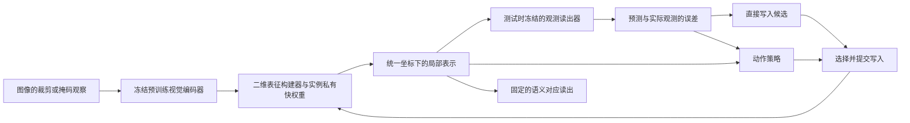

# 二维切口筛选与模型调整建议

日期：2026-09-20  
项目：CV / Measurement Scene State  
文档状态：文献核查与候选设计；未实现、未训练、未验证的新二维方案。

## 1. 建议优先研究什么

**首选切口：预训练视觉特征在补充局部细节时，怎样避免把纹理、背景等实例差异也写进去，从而破坏语义对应。**

具体任务先选二维跨实例语义对应：在一张狗的图像上指定耳尖，到另一张不同姿态、毛色的狗的图像中找同一语义位置。这个任务既需要局部定位，也需要忽略不该匹配的外观差异，比分类准确率更直接地检验局部表征。

拟研究的问题是：模型对当前图像做自监督修正时，某次更新究竟会帮助它找到耳尖，还是只会让它更认真地记住这只狗的毛色？能否只利用部署时可得的观测、误差和更新历史，选择有益的写入位置与步骤？

这是**值得先验证的假设**。本轮没有发现足以支持“这个方向肯定没人做过”的证据，也没有实验表明重建误差已经能预测语义收益。真实观测监督和动态 TTT 都有近邻；论文必须依靠更具体的发现、机制和结果成立。

首轮采用冻结的 DINOv2 小模型和小规模对应数据，建立诊断后再训练适配器与策略。DINOv3 用来检验问题是否仍存在于更强的特征上。视频中的错误记忆累积保留为第二候选，暂不同时展开两个完整项目。

## 2. 为什么不直接把旧三维模型改成二维

旧路线同时要求模型学会几何、外观、融合、补全、写入以及动作策略。已有负结果不能单独归因于“三维太难”；载体容量、训练规模、写入方向和动作教师都可能限制效果。

二维重构的收益在于可以利用成熟预训练特征，把问题缩到“已有表征的哪一种错误值得修、怎样修”。它不是二维天然优于三维的证明。

从旧方案中保留两件事：

1. **逆向 JEPA 的研究动机**：共同的内部表示需要接受真实观测检查，不能只靠另一个网络的隐藏向量给自己打分。
2. **动态 TTT 的实际机制**：实例私有的快权重改变可学习映射；动作根据已经得到的证据和当前状态变化，后续动作读取更新后的状态。

不要求继续使用三维坐标、体素、相机或物理渲染器。也不能把“逆向 JEPA”当成已经确立的新算法名称：转到二维后，它与掩码重建、自编码和多视图一致性的边界需要重新证明。

## 3. 从 LazyStrike 真正应该借鉴的东西

《Vision Transformers Need More Than Registers》[1] 的价值是把一个问题做得很具体：部分局部 token 表现出的语义，不一定忠实属于其对应图像区域；只处理高范数 token 并不能解决全部问题。论文用针对性的测量与干预定位机制，再修改预训练中的信息聚合。

它不是动态 TTT 方法。其语义扩散现象也不能直接等同于“模型因果上依赖背景纹理”；这需要独立改变背景并检查预测。

我们应借鉴这个研究顺序：

**明确局部失败 → 排除便宜修法 → 证明失败与学习机制有关 → 给出对应的修正。**

不能先把两个模块装上，再从某个 benchmark 的上涨反推它们解决了“lazy aggregation”。如果采用本文切口，需要独立证实下面的链条：

- 局部细节缺失或上下文变化确实造成一部分对应错误。
- 在相同预算下，观测约束能修复其中一部分，同时也会伤害另一部分。
- 有益与有害更新在部署可得信号上存在可学习的区别。
- 动态写入能利用这种区别，超过强固定方法。

前两点给出问题，第三点给出方法机会，第四点给出实际价值。当前四点都尚未在本项目二维实验中验证。

## 4. 候选切口排序

| 候选 | 精确问题 | 两个核心的结合方式 | 主要风险 | 建议 |
| --- | --- | --- | --- | --- |
| A：保留语义的局部细节修正 | 补定位细节的更新可能同时强化实例纹理，损害跨实例对应 | 观测误差提出修正，任务收益驱动的离线训练教会策略选择写入 | 重建与语义不变性冲突；可能退化为普通适配器加选择器 | 首选小规模诊断，主载体为语义对应 |
| B：视频中的错误记忆累积 | 遮挡、相似物体、错误预测被写入后，后续帧可能沿着错误继续更新 | 用后续可得图像检查状态，动态决定是否写入和写入位置 | XMem、Cutie 等记忆机制很强；运动、关联和伪标签使归因复杂 | 第二候选；若核心价值主要来自历史和顺序，优先转到这里 |
| C：VLM 局部视觉证据与答案不一致 | 全局语义可能支持一个答案，局部观测却不支持定位 | 在回答前修正局部视觉表示 | 语言先验、视觉编码、定位与生成同时变化，难以清楚归因 | 暂不主攻 |

以下方向不宜单独充当主创新：去除 ViT 特征伪影、把特征图变清晰、裁剪一致性、按输入选更新层。它们均有直接相关方法。

## 5. 最近工作已经覆盖到哪里

| 工作 | 已覆盖的内容 | 对本方案的限制 |
| --- | --- | --- |
| Denoising Vision Transformers，ECCV 2024 [2] | 分析位置相关特征伪影，利用跨视图分解与去噪改善特征 | 不能把所有局部失真都当成新发现；稳定伪影可能用一次静态修正就解决 |
| FeatUp，ICLR 2024 [3]；LiFT，ECCV 2024 [4]；FeatSharp，ICML 2025 版本 [5] | 特征分辨率、局部细节与边界恢复 | 增益可能来自更多像素、更高分辨率或小后处理器，而非动态学习 |
| CLIPSelf，ICLR 2024 [6] | 同一区域在整图中的特征与其裁剪图特征存在差异；用裁剪表征作教师 | “不同上下文约束同一区域”不能单独声称原创 |
| SCLIP，ECCV 2024 [7] | 通过固定的注意力修改改善 CLIP 密集预测 | 若改用 CLIP/VLM，必须排除简单注意力修正即可解决问题 |
| DINOv3，2025 技术报告 [8] | Gram anchoring 处理长训练中的密集特征退化，并提供强密集特征 | 必须检查旧模型上的问题在新模型上是否还具有足够规模 |
| Test-Time Training with Masked Autoencoders，NeurIPS 2022 [9] | 用测试图像的掩码像素重建更新模型 | “真实像素作为测试时反馈”已存在；普通重建加 SGD 不能换名成逆向 JEPA 新贡献 |
| Test-Time Training on Video Streams [10] | 当前帧与近期历史的重建、跨时间继承适配参数 | “历史状态 + 当前无标签反馈”已存在 |
| GALA，AAAI 2025 [11] | 根据当前梯度与历史位移的对齐选择更新层，并处理不可靠样本 | “动态选择更新哪个模块”本身不足以成立 |
| CTA，2025 预印本、页面标注 under review [12] | 显式处理辅助自监督任务与下游语义目标的冲突 | 不能把“辅助 loss 下降不等于任务变好”作为首次发现 |
| ReC-TTT，2024 预印本 [13] | 特征重建式 TTT，测试时冻结解码器 | 冻结目标/解码器并进行表征重建，也不是空白区域 |
| Telling Left from Right，CVPR 2024 [14] | 对称性、姿态、方向与几何感知的语义对应 | 对应错误不都来自分辨率或纹理；仅重建像素不能保证解决左右歧义 |
| Geometry Matters，2026 预印本 [15] | 用三维基础模型先验改善语义对应 | “二维任务缺空间结构”已有强竞争路线；不应假定纯二维重建必然胜过几何先验 |

这些方法不是全部都要在第一轮复现。应先实现最能否定自己解释的少数对照；正式对比再根据任务与协议选择论文。

**本轮的创新判断：**“像素重建 + 私有适配器 + 动态选层”仍很容易被评价为组合。更值得争取的增量是：针对局部细节与跨实例不变性的具体冲突，找到可检验的行动收益信号，并证明它能够控制真正改变表示的写入。这个增量还没有成立。

## 6. 推荐模型：先保证每个部分有必要

### 6.1 总体结构



首版对图像对中的两张图分别适配，快权重互不共享，不让一张图的匹配结果直接成为另一张图的伪标签。最终使用同一种匹配读出，避免通过更复杂的匹配头掩盖表征变化。

### 6.2 载体与初始化

- 起点：冻结 DINOv2 ViT-S/14；使用公开预训练权重，不从随机 CNN 开始学整个视觉系统。
- 二维状态：按裁剪几何映射回统一图像坐标的 patch token，保留有效区域信息。
- 慢参数：小型残差表征构建器、观测读出器、写入投影、动作策略；离线训练，部署冻结。
- 快参数：每张图私有的小矩阵，作用于实际特征映射，episode 结束后重置。
- DINOv3：作为更强载体的压力测试。官方提供小型与基础模型，但权重访问需要申请；本轮未测试账号权限，也未下载权重。

冻结小模型适合优先在现有 12GB 显存条件下试验；具体分辨率、展开步数和显存占用必须实测，不预报未经测量的训练时长。

### 6.3 “逆向 JEPA”在这里体现在哪里

从同一图像的不同观察集合构建局部状态，用受约束的读出器预测真实图像中的测量：

$$
S_t=H_\theta(\mathcal B_t;W_t),\qquad
\hat y_q=D_\psi(S_t,q),\qquad
y_q=T_q(x).
$$

$\mathcal B_t$ 是当前已纳入的观察；$q$ 指定位置、尺度和读出方式；$T_q$ 是对原图进行确定性裁剪或测量的程序。起点可使用归一化局部 RGB，并单独评估梯度等低层测量的作用，避免一开始堆叠大量辅助目标。

这里将输入契约分成两种：正常适配允许观察重叠或重复，不能称为严格未见区域预测；独立的未见区域诊断则必须把目标像素排除在所有编码器输入、历史观察、缓存和此前写入之外，掩码在编码器前实施。$T_q(x)$ 只定义目标来源，不授权状态构建器提前读取这些像素。两种协议使用不同 manifest。

同一状态需要支持多个位置和裁剪的检查；实际像素进入目标端，不能另设读取原始 RGB 的旁路替状态完成预测。共同目标应来自同一实例，不要求两只不同的狗具有相同 RGB。

**这是对旧方案的一项实质放宽：**二维观测读出器拟采用小型、离线训练后冻结的解码器，已不再是旧方案的零参数物理渲染器。冻结不等于固定物理测量，不能继续沿用后者的强解释性主张。

这种目标本身与掩码重建接近；同一目标上的两项相加损失也不会自动成为新算法。需要比较真实观测目标与特征教师目标，检查共享状态、受限读出以及后续写入是否分别有作用。

### 6.4 怎样保留真正的动态 TTT

先只设置两个候选可写位置：一个改变通道映射，一个改变局部邻域信息融合。它们是不同计算位置，不预先声称前者“学语义”、后者“学结构”。

保留旧路线的直接快权重写入，而不是悄悄替换成普通 SGD 或单纯缓存：

$$
S_t^-=H_\theta(\mathcal B_{t-1};W_{t-1}),\qquad
\hat y_t^{\mathrm{pre}}=D_\psi(S_t^-,q_t).
$$

先得到上述预测，再按当前观察计划揭示 $y_t=T_{q_t}(x)$，随后计算：

$$
e_t=y_t-\hat y_t^{\mathrm{pre}},
$$

$$
\Delta W_{\ell,t}=
\operatorname{clip}_F\left(
\eta_\ell
\frac{\sum_i q_{t,i}\,v_{\ell,t,i}u_{\ell,t,i}^{\top}}
{\epsilon+\sum_i q_{t,i}}
\right),\qquad
v_{\ell,t,i}=B_\ell e_{t,i}.
$$

这是首版候选形式，不是推导出的最优更新律。$B_\ell$ 在离线阶段学习，部署时固定；$u$ 来自对应可写位置，$q$ 处理有效性、重叠与采样权重。真实观测误差直接进入建议写入方向；后续若增加非线性写入器，必须证明它比这个简单版本有用。

动作集合先用 $\{\mathrm{OFF},A,B,\mathrm{ALL}\}$。OFF 仍接收相同的新观察，只是不写快权重。ALL 从同一旧状态生成两个候选并同步提交；$A\to B$ 与 $B\to A$ 是连续两步，第二步读取第一步后的状态，不能与 ALL 混称。

策略看更新前的观测误差、跨观察一致性、特征变化、历史动作和剩余预算。动作选择不能使用本次写入后的结果冒充预先可得信号。前一步的执行结果可以作为下一步的合法历史。

每步的具体顺序为：已有状态与下一观察的位置/掩码定义 → 先预测该观察 → 揭示实际像素并编码 → 计算预写入残差 → 用旧快权重和合法当前观察生成候选、选择动作 → 纳入新观察并提交写入 → 重建状态。第一份观察用于初始化；不能先用当前像素重建状态，再把它生成的误差称为对新观察的预先预测。正式图像对任务中原始图像已经可用，这是一种受控的内部观察计划，不能据此宣称获得了新的外部信息。

**这修正旧路线中的一个重要弱点：**旧视觉写入主要由特征统计给出，观测残差主要影响动作选择；新候选让残差同时影响写入内容和动作选择。它仍需通过实验证明有益，不能凭形式推断正确。

### 6.5 为什么需要任务收益教师

降低 RGB 重建误差可能强化毛色差异，使跨实例对应更差。因此离线训练应问“这次行动能否改善对应”，而不是奖励“把图像重建得更像”。

在训练图像对中，用相同前缀、相同观察和相同预算隔离比较候选动作：

$$
U_t(a)=Q(S_{t+h}^{a},\mathcal K_{\mathrm{train}})
-Q(S_{t+h}^{\mathrm{OFF}},\mathcal K_{\mathrm{train}})
-\lambda C(a).
$$

$Q$ 是越大越好的对应得分；$\mathcal K_{\mathrm{train}}$ 为训练集关键点；后续观察序列和比较终点一致。第一轮从一步收益开始，只有顺序机会得到证实才增加有限 horizon。

训练关键点只教策略与慢参数，部署时不能访问。方法应明确标为**有监督训练、测试时无标签适配**，不能称为全流程无监督或零样本。训练 adapter 的对应损失与策略教师也必须使用同一训练边界。

主 benchmark 使用官方划分。另做按图像身份隔离的机制诊断，防止同一图像经不同 pair 出现在教师拟合与诊断验证两侧。如果要声称未见类别迁移，再单独做类别隔离；不要把自定义类别划分的分数冒充官方排行榜结果。

### 6.6 图像对为什么也能有多步适配

这里的“动态”是一次测试推理内部的学习轨迹：从固定的裁剪/掩码计划中逐步取得观察，决定本步怎样更新。它不是把 SPair 的 pair 顺序当作真实时间，也不是自然视频流。

预先固定观察预算与计划，动作只决定写入，暂不同时学习下一次看哪里。这样能避免把主动裁剪、高分辨率输入、更多像素和写入策略混成一个收益。

若多步轨迹只能被最好固定顺序解释，或者对称 crop pooling 已达到相同效果，应收缩动态主张。若必须借助真实时间、遮挡和恢复才能显示核心价值，再转到候选 B。

## 7. 最容易产生假阳性的地方

**重建泄漏。** 如要预测掩码内容，掩码必须在编码器之前实施；把整图编码后的 token 清零，不能消除上下文已经携带的信息。反复适配同一图时，快权重可能已经见过其他 mask 下的那些像素，不能声称每次都是未见目标预测。

标准 benchmark 允许模型使用给定测试图像做自监督适配；这不等于严格未见区域预测。若诊断后一种能力，留出区域必须从所有历史观察、缓存和写入中排除。两种实验分别登记，不互相替代。

**一致性不等于正确。** 两个裁剪可能稳定地匹配到同一个错误部位。跨视图一致性只是候选反馈，真正的语义收益需要在独立有标签评估中检查。

**纹理与结构不能随意划线。** 一些纹理对类别或关键点确实有帮助；背景替换、颜色变化也并非在所有图像中都保持任务语义。干预必须说明改了哪些像素、保留了哪些区域以及关键点坐标怎样变换。

**搜索上限不是部署结果。** 使用关键点挑出最好动作只能证明有限动作集合有机会。部署策略只看无标签信号；需单独报告它与搜索上限的差距。

**重复使用探针。** 一个裁剪若已参与动作选择，就属于选择数据，不能再次当独立验证证据。有限轨迹搜索也存在选择偏差，不能把其最好值当作总体最优。

**有序数值差异不是有用轨迹。** 必须区分更新矩阵不同、预测不同、任务收益不同、以及部署策略能预测这种收益。只有最后两步支撑动态控制价值。

## 8. Benchmark、数据与资源

| 用途 | 数据或模型 | 本轮核实信息 | 使用边界 |
| --- | --- | --- | --- |
| 快速通路检查 | PF-PASCAL [17] | 官方页面约 1,300 对、20 类，压缩包标称 49.2 MB | 便宜，但变化较小；不能单独支撑主结论 |
| 主要对应任务 | SPair-71k [16] | 70,958 对、18 类；train/val/test 分别 53,340/5,384/12,234；官方包标称 230.8 MB | train 拟合、val 选择、test 冻结后评分；不要用 test 挑切口或调策略 |
| 初始载体 | DINOv2-S/14 [18] | 官方提供 patch tokens 和预训练模型；小模型约 21M 参数 | 冻结 backbone，训练小模块；下载与显存尚未实测 |
| 更强载体 | DINOv3 [8] | 官方提供 S/16、B/16 等；权重需要申请访问 | 先检查失败现象；不能把换 backbone 的差异单独解释为策略泛化 |
| 视频备选 | DAVIS 2017 [19] | 成熟的视频分割数据与官方评价代码 | 明确首帧标注属于任务允许输入；之后禁止读后续真值 |
| 视频强参照 | XMem、Cutie [20,21] | 有公开模型与推理代码、显式记忆机制 | 是 VOS 系统，不能当作同一 ViT backbone 的适配消融 |

以上大小是官网列出的压缩包信息，不是本机已下载大小，不包含权重、特征缓存和实验输出。首轮数据远小于此前约 100GB 的 Hypersim 包，无需为此再准备一套百 GB 数据。

对应指标采用官方 PCK 口径，明确阈值、参考尺度、坐标变换、图像尺寸和聚合方式。报告 PCK@0.1 时也必须说明是 bbox 还是 image normalization，不能仅凭相同指标名字比较论文表格。

公开结果可以直接引用，但需核对 backbone、预训练数据、关键点监督、额外训练集、输入分辨率和测试时计算。它们用于外部定位；验证写入机制仍需要少量同载体、同预算对照。

## 9. 小实验如何决定是否值得完整重构

### 阶段一：先量到值得修的失败

在 SPair 官方 train/val 中固定小规模诊断集，覆盖多个类别和尺度、遮挡、视角条件；不先打开 test 标签来寻找有利子集。计算冻结 DINOv2 的对应与 crop 稳定性。

检查同一区域在不同上下文下的特征变化，配合保持目标区域不变的局部干预，判断这类变化与对应错误是否有关。保留遮挡、对称性、方向歧义等无法由局部锐化解决的错误类别。

优先比较冻结特征、提高分辨率、crop pooling、同大小静态 adapter，以及一个可用的固定密集特征修正方法。若简单方案已经消除所针对的失败，停止复杂 TTT 路线。

### 阶段二：证明存在有用的行动选择

离线训练一个最小观测读出器和写入器，再在独立开发图像上比较 OFF、固定 A、固定 B、ALL、固定顺序与有限动态候选。首轮预算可从每张图 1、2、4 次写入起步；这是实验设置，不是声称四步足够。

必须在相同观察数、输入像素、适配器参数和计算账单下比较。记录辅助误差下降但 PCK 变差的样本，而不是只画成功例子。

所需证据是：不同样本或历史确实需要不同动作，并且动作机会不只是来自多算了一次。只有重建 loss 下降，没有对应收益，应停止把它视为有效语义修正。

### 阶段三：证明部署信号能利用机会

训练只读取允许反馈的策略，对比最好固定策略、残差阈值策略、梯度/更新对齐选择及固定预算下的一步贪心方法。GALA 若移植到新 host，应标注为我们的适配版本；原论文数字不能直接代替这个对照。

检查策略的任务收益、伤害率、预算、与离线最好候选的差距。加入重复观察、单次异常观察、观察顺序置换，检验历史状态是否真的有作用。停止也是预算决策，应与相同平均计算及相同最大预算的方法分别比较。

PCK 的不确定性需考虑一个图像可出现在多对中的相关性；诊断可按图像连通组重采样，不能把重复使用同一图像的 pair 全当独立样本。小样本结果只用于筛选，不能宣称覆盖全部 18 类。

### 阶段四：再做正式训练与外部结果比较

前三阶段成立，才扩大训练并冻结配置，运行官方 test。再检查更强 backbone 和第二数据集；更换 backbone 若重新训练了模块，应明确报告，不能称为零训练迁移。

没有“涨一点 PCK 就能中 CVPR”的门槛。需要同时看到可解释的失败模式、必要的机制、合理成本及足够强的外部竞争力。

### 明确停止或转向的条件

| 结果 | 决策 |
| --- | --- |
| 当前问题在强 backbone 上很小，或静态修正即可解决 | 缩小问题范围；不要为了保留两个核心硬加动态模块 |
| 真实观测目标持续强化纹理、损害对应 | 拒绝这条 grounding 实现；换成特征教师后若有效，应承认逆向 JEPA 没得到支持 |
| 有离线动作机会，但无标签反馈无法学出稳定收益 | 保留诊断，不宣称有部署方法；检查训练分布和可观测性 |
| 固定顺序或一步策略与动态轨迹相当 | 删除长期轨迹主张，采用简单方法 |
| 收益主要体现在污染后恢复与长历史，而非静态对应 | 将视频中的错误记忆写入作为主问题，重新对齐 VOS 协议 |
| 只有弱载体或额外高计算时获益 | 按受限范围报告，不能声称普适改进视觉基础模型 |

## 10. 旧代码怎样拆分与复用

当前旧代码根目录为 `<workspace-root>`。本轮只形成调整建议，没有修改旧模型或实验产物。

| 旧部分 | 二维路线中的处理 |
| --- | --- |
| V5、体素载体、相机与物理 renderer | 保留为旧路线；二维包不直接修改或冒充兼容 |
| 私有快权重、episode/branch/state 身份、候选提交约束 | 复用设计契约；检查数据类型后有选择地复用实现 |
| OFF 仍纳入新观察、ALL 同源提议 | 保留，以排除输入量和执行路径差异 |
| 三维 lifting、密度、深度与渲染反馈 | 替换为二维坐标映射、局部表示和观测读出 |
| 由特征统计生成的写入目标 | 增加残差直接进入写入方向的最小实现与对照 |
| 仅深度效用的动作教师 | 替换为训练对应任务收益与成本，保留标签隔离 |
| DL3DV/NVS evaluator | 新建官方对应协议 evaluator，不混用分数与 checkpoint |

推荐独立包边界：

```text
mcss/local_adaptation/
  data/          # 图像身份、划分、裁剪与坐标变换
  backbone.py    # 冻结编码器与缓存来源
  state.py       # 二维状态、有效区域、实例私有快参数
  host.py        # 两个实际可写位置与共享状态构建
  readout.py     # 观测读出，禁止 RGB 旁路
  feedback.py    # 预写入误差和合法历史统计
  write.py       # 残差投影、直接矩阵更新、同步提交
  policy.py      # 部署动作选择
  training/      # 慢参数训练、候选分支、收益教师
  evaluation/    # 固定匹配器、PCK、成本与干预诊断
```

这是建议目录结构，尚未创建。无需第一轮就实现全部模块：先把冻结特征、官方评价与简单对照接通，再按行动机会决定写入器和策略是否值得建。

## 11. 最终判断

二维路线值得探索的理由，是可以借助可靠的视觉预训练，把问题缩到一个可观察、可比较的局部机制。当前最值得下注的小问题是：**如何利用图像细节修正局部表征，同时保留跨实例语义对应所需的不变性。**

逆向 JEPA 提供“用实际观察检验状态”的动机；动态 TTT 提供“根据证据选择真实学习动作”的手段。但真实观测不自动等于正确语义，动态也不自动胜过固定。这两个缺口正是下一步要检验的内容。

当前可以交给合作者的结论是：已有一个边界清楚、数据轻量、能被快速否定的候选研究方向；尚没有一个得到验证的新二维算法，更没有依据保证 CVPR 录用。

## 12. 来源与核查范围

本轮使用公开论文页面、相关方法/实验正文片段、作者项目页、官方仓库与数据页核对；文献发现阶段也使用 Hugging Face Papers 的检索结果，再回到一手来源。并非对所有列出论文逐页精读，也不是穷尽式新颖性检索。论文状态按本轮读到的页面标注，预印本不升级为已录用。

1. [Vision Transformers Need More Than Registers](https://arxiv.org/abs/2602.22394)，页面标注 CVPR 2026；[正文 v2](https://arxiv.org/html/2602.22394v2)；[官方 LAST-ViT](https://github.com/ChengShiest/LAST-ViT)。
2. [Denoising Vision Transformers](https://arxiv.org/abs/2401.02957)；[官方代码](https://github.com/Jiawei-Yang/Denoising-ViT)。
3. [FeatUp: A Model-Agnostic Framework for Features at Any Resolution](https://arxiv.org/abs/2403.10516)；[官方代码](https://github.com/mhamilton723/FeatUp)。
4. [LiFT: A Surprisingly Simple Lightweight Feature Transform for Dense ViT Descriptors](https://arxiv.org/abs/2403.14625)；[官方代码](https://github.com/saksham-s/lift)。
5. [FeatSharp: Your Vision Model Features, Sharper](https://arxiv.org/abs/2502.16025)；[官方代码](https://github.com/NVlabs/FeatSharp)。
6. [CLIPSelf: Vision Transformer Distills Itself for Open-Vocabulary Dense Prediction](https://arxiv.org/abs/2310.01403)；[官方代码](https://github.com/wusize/CLIPSelf)。
7. [SCLIP: Rethinking Self-Attention for Dense Vision-Language Inference](https://arxiv.org/abs/2312.01597)；[官方代码](https://github.com/wangf3014/SCLIP)。
8. [DINOv3](https://arxiv.org/abs/2508.10104)；[官方仓库与模型访问说明](https://github.com/facebookresearch/dinov3)。
9. [Test-Time Training with Masked Autoencoders](https://arxiv.org/abs/2209.07522)；[项目页](https://yossigandelsman.github.io/ttt_mae/index.html)；[官方代码](https://github.com/yossigandelsman/test_time_training_mae)。
10. [Test-Time Training on Video Streams](https://arxiv.org/abs/2307.05014)；[项目页](https://video-ttt.github.io/)；[官方代码](https://github.com/renwang435/video-ttt-release)。
11. [A Layer Selection Approach to Test Time Adaptation / GALA](https://arxiv.org/abs/2404.03784)，AAAI 2025；[正文](https://arxiv.org/html/2404.03784)。
12. [CTA: Cross-Task Alignment for Better Test Time Training](https://arxiv.org/abs/2507.05221)，页面标注 Preprint, under review。
13. [ReC-TTT: Contrastive Feature Reconstruction for Test-Time Training](https://arxiv.org/abs/2411.17869)；[论文所给代码](https://github.com/warpcut/ReC-TTT)。
14. [Telling Left from Right: Identifying Geometry-Aware Semantic Correspondence](https://arxiv.org/abs/2311.17034)；[官方代码](https://github.com/Junyi42/geoaware-sc)。
15. [Geometry Matters: 3D Foundation Priors for Learning Semantic Correspondence](https://arxiv.org/abs/2605.30093)，2026 预印本。
16. [SPair-71k 官方数据页](https://cvlab.postech.ac.kr/research/SPair-71k/)；[论文](https://arxiv.org/abs/1908.10543)。
17. [PF-PASCAL / Proposal Flow 官方页面](https://www.di.ens.fr/willow/research/proposalflow/)。
18. [DINOv2 官方模型与使用说明](https://github.com/facebookresearch/dinov2)。
19. [DAVIS 2017 官方评价代码与协议入口](https://davischallenge.org/davis2017/code.html)。
20. [XMem 官方仓库](https://github.com/hkchengrex/XMem)。
21. [Cutie 官方仓库](https://github.com/hkchengrex/Cutie)。

项目设计承接：[2026-09-17 合作者方案](./CV_逆向JEPA与动态TTT_合作者完整讨论方案_2026-09-17.md)，尤其是原始逆向 JEPA 的功能定义、ICLR 初稿的直接快权重写入、OFF/ALL 与轨迹诊断边界。本轮重新核对了这些章节；旧项目记忆仅作契约背景，不作为新的运行状态或性能证据。
