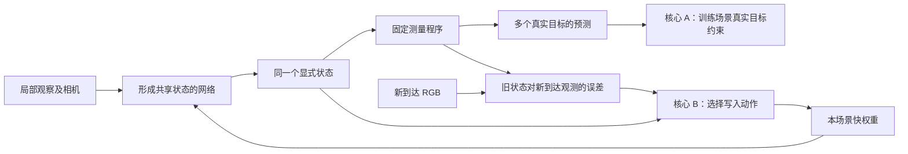
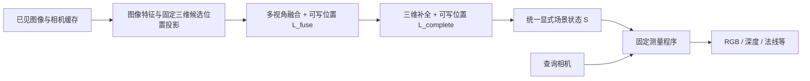

# 逆向 JEPA 与动态 TTT：真实观测约束的共享场景状态学习

**工作题目：Learning and Revising Shared Scene States through Grounded Prediction and Dynamic Test-Time Writes**

**中文题目：真实目标预测与动态测试时写入驱动的共享场景状态学习**

版本：v2.0 · 日期：2026-09-17 · 项目：CV / Measurement Scene State

> 文档状态：完整设计提案，`provisional`。用户确认以“逆向 JEPA”和“动态 TTT”为两个方法核心；联合方法尚未实现或完成实验验证。“两个核心”规定研究组织方式，不表示两项新颖性已经完成文献核验。本文件不是冻结的实验协议。

本方案研究：**从不同局部观察中，学习一个能被多个真实观测共同检验的共享状态；当新观测暴露错误时，通过动态 TTT 修正形成这个状态的机制。**

核心 A 是逆向 JEPA 的可执行版本：以真实目标预测约束共享状态，并检验跨上下文的功能一致性及未直接训练的测量能力。核心 B 是动态 TTT：根据当前可得证据和学习历史选择写入动作，使同一状态在观测到来后持续修正。固定测量程序连接两个核心：训练时提供真实目标约束，部署时产生可用于动作选择的预测误差。

v2.0 在原文档内更新：恢复逆向 JEPA 的来源与命题，加入多上下文共同目标训练、表示学习对照、测量留出协议和双因素实验，并重排执行顺序。原有直接外积写入、前缀信息隔离、同步提交及预算账本继续适用。

阅读建议：第 1、5.5—5.6、6—7 节解释原理；第 8 节规定两核心如何训练；第 10.6—10.9 节与原动态对照共同组成证据矩阵；第 13—18 节说明判据、实施顺序和贡献边界。

## 1. 两个核心分别解决什么问题

### 1.1 核心 A：逆向 JEPA，表示由真实目标约束

本项目使用“逆向 JEPA”作为原始思路的工作简称，不把它当作已有标准方法名。2026-06-18 的原截图提出：将典型 JEPA 的目标编码与潜空间预测路径，改写成从上下文表示恢复真实目标的单路径。

$$
\text{Typical JEPA:}\quad
x_C\xrightarrow{E}h_C\xrightarrow{P}\hat h_T,
\qquad h_T=E_T(x_T).
$$

$$
\text{Grounded prediction:}\quad
x_C\xrightarrow{E}h_C\xrightarrow{P}\hat y_T,
\qquad \hat y_T\approx y_T^{\mathrm{real}}.
$$

“逆向”指将目标端编码后对齐的角色改为从表示恢复真实目标，不要求 $P=E_T^{-1}$。原截图进一步猜测：不同观察被同一真实目标约束时，网络内部会形成共同结构；predictor 可以包含数学计算模块。当前方案承接这一研究动机，但不接受“必然自动对齐”或“不会坍塌”为已证明定理。

本项目将其具体化为：

$$
S_C=D_\theta(B_C,W^{(0)}),\qquad
\hat y_q^m=\mathcal M_m(S_C,q).
$$

不同上下文子集各自构建一个与查询无关的状态，同一状态必须通过固定测量程序解释多个真实目标。三维密度、颜色及坐标是这里选择的结构先验。因此，本版本检验的是**显式共同状态是否具有可验证的预测能力**，不是宣称任意黑箱中间层会自发发现相同三维坐标。

### 1.2 核心 B：动态 TTT，状态怎样随证据修正

ICLR 初稿研究固定模型与写入规则下，不同 chunk 的写入位置能否构成优于常量动作的轨迹，以及历史形成的状态怎样影响续接结果。视觉方案继承直接快权重写入和轨迹问题，新增只使用当前及过去信息的控制器。

$$
S_t=D_\theta(B_t,W_t),\qquad
a_t=\pi_\psi(\text{observed evidence, state, history, budget}),
\qquad W_t=W_{t-1}+\delta W_t(a_t).
$$

动态性发生在“本次怎样更新形成状态的机制”，不是由最终测试答案选择最优轨迹，也不是指场景中的物体必须运动。

### 1.3 两个核心的连接

| 部分 | 提供的能力 | 在联合方案中的作用 |
| --- | --- | --- |
| 核心 A：真实目标约束的共享状态学习 | 不同局部观察通过共同状态解释真实目标 | 决定学到的表示应满足什么要求 |
| 核心 B：动态测试时写入 | 根据状态和证据选择写入位置及轨迹 | 决定怎样持续修正形成表示的机制 |
| 固定测量与更新前反馈 | 用同一规则预测并检验已到达观测 | 连接状态质量与动作选择，不另包装为第三个核心 |

真实目标具有两个不同角色：离线训练时，训练场景的多个目标为核心 A 提供监督；在线运行时，刚到达的 RGB 是合法的新证据，用来检验旧状态。永久留出测试目标始终不能进入在线反馈或写入。



要分别证明 A 的表示能力、B 的动态收益，以及 A 提供的反馈是否对 B 有帮助。联合方法成绩好，不能代替其中任意一项的独立证据。

### 1.4 一个具体例子

两组不同局部图片都来自同一房间。核心 A 要求各组图片形成的状态都能预测共同的留出视角；如果预测中的门框位置一致而且与真值一致，才有关于共同几何的证据。两组都生成同一堵错误的墙，只能说明共同出错。

在部署序列中，相机从正面转向侧面，侧面照片可能否定之前对门的位置的判断。核心 B 选择这一步应该调整融合还是补全，并检验这种选择能否改善后续未见视角。相同 RGB 残差也可能来自颜色或光照，不能直接当作几何错误及其修正方向。

这两个例子分别对应“学到的共同状态是否可信”与“怎样让它继续改进”。不预先指定“先融合、后补全”；动作功能和顺序都由实验检验。

### 1.5 选择与范围

| 路线 | 能回答的问题 | 本方案的位置 |
| --- | --- | --- |
| 只训练真实目标预测与共享状态 | 核心 A 是否成立 | 必做的静态证据层 |
| 给既有载体添加固定或动态写入 | 核心 B 是否带来收益 | 必做的同载体比较 |
| 共同真实目标学习 + 测量反馈引导动态写入 | 两核心能否形成有用的整体 | 本方案主线 |

第一版采用已标定静态场景，保留可检查的三维结构。直接优化 density/color 是必须正面对照的强基线；若它在相同资源下更有效，应收缩本方法的实用主张。

## 2. 依据、已知事实与尚未证明的部分

### 2.1 ICLR 初稿实际提供了什么

依据是用户提供的《Beyond Static Writes: Trajectory and State Diagnostics for In-Place Test-Time Training》，共 20 页，已在本任务前序通读。文件名包含 ICLR2026，正文页眉使用 ICLR 2027 under-review 模板；这里按用户说明将其视为初稿，不据此宣称已投稿或录用。

初稿中的动作集合为：

$$
\{\mathrm{OFF},L_0,L_6,L_{12},L_{18},L_{24},\mathrm{ALL}\}.
$$

动作选择 MLP 下投影的写入位置。更新为带冻结目标投影、带符号通道 gate 和范数裁剪的直接外积；测试时没有 inner-loss backward、Adam 或 ridge solve。`OFF` 保留历史，只关闭当前新增写入。

初稿报告：6,000 个例子的动态搜索成绩比逐例最佳固定动作高 1.522 个百分点；实际搜索的 1,435 个非满分例子上提高 6.362 个百分点。73 条原本多次切换的改进轨迹里，60 条存在一次切换的同分替代。这些是**初稿报告的既有结果，本次没有复跑模型或独立重算原始结果表**。

必须保留的解释边界：

- 动态轨迹用最终答案分数搜索得到；初稿没有可直接部署的 answer-free controller。
- Reverse 同时改变动作与内容的配对以及后续状态，不能单独识别纯历史作用。
- 初稿明确报告 prefix cache 与执行路径的影响，未建立实现无关的普遍机制。
- 一次切换的结果是在选定改进轨迹上的存在性结果，不能直接推成所有视觉序列都只需一次切换。
- ICLR 的 layer-major 执行前已知整条轨迹；本方案的逐观测在线控制需要明确的新执行协议。

### 2.2 CV 项目的现实起点

当前实现路径为 `D:/code/codepy/measurement_scene_state`。此前核对的 V5 每次根据固定上下文重建状态，没有持久的测试时快权重或控制器。

V5 的单训练窗口结果只能说明容量和回归能力。前序审计还发现了真实的多场景 V5/CSGC pilot，收益混合；这不构成当前联合方法的结果，也不足以宣布新基线全面胜出。本轮文档不重报实验数字，避免把历史检查当作新运行。

本方案保留显式状态、统一测量和相机几何契约，提出新的载体和更新机制。对旧密度约束的修改应只进入新方法实现，旧 V5 比较包保持可恢复。

### 2.3 新贡献的候选边界

两项候选贡献分别表述为：

1. **真实目标约束的共享表示学习。** 将原始逆向 JEPA 思路落实为多上下文共同目标预测：查询无关的 typed state 通过同一个固定测量程序解释真实观测，结合跨上下文、留出测量和解码器对照检验这种约束学到了什么。
2. **面向该共享状态的动态 TTT。** 在直接快权重写入规则下，用当前可得的测量反馈与历史预测动作的后续收益，并用同载体基线及历史干预检验前缀可部署控制。

第 1 项不能简化为“第一次去掉 target encoder”，第 2 项不能简化为“第一次测试时更新参数”。真实目标重建、固定渲染、显式三维状态、快权重和一般动态选择都有已有基础。跨上下文共同目标训练的具体增量同样需要实验和针对性文献比较，不能因为原始思路由我们提出就推成领域内独一无二。

tttLRM、ZipMap 是需要正面对照的三维 TTT 工作；MAE、GQN、NVS 和典型 JEPA 系方法分别约束第 1 项的比较边界。本次更新没有做截至投稿日的穷尽新颖性检索。两核心是否都足以成为论文贡献，取决于具体机制和结果，而不是命名。

### 2.4 从原始设想到当前版本，保留与改变的部分

| 原始设想 | 当前处理 |
| --- | --- |
| 局部观察直接预测真实目标 | 保留为主训练路径；真实目标不经过可训练目标编码器来定义监督 |
| 共同目标可诱导内部共同结构 | 保留为待检验命题；通过多上下文共同目标和交叉评价落实 |
| 某层必然自动对齐 | 改为有限测量下可检验的功能一致性，不要求任意隐藏向量相等 |
| 真实 target 保证不坍塌 | 删除保证；共同错误、纹理捷径和不适定性都必须诊断 |
| predictor 可以包含数学模块 | 采用显式场景构造与固定测量；这是选定实现，不等于原思想只有渲染器 |
| 各条预测路径都不影响最终结果 | 不作为前提；动态 TTT 正要检验不同历史和路径是否影响结果 |

“真实观测”仍是世界的一次测量，包含遮挡、噪声和光照，不等于完整世界真值。固定测量约束输出语义，也不自动保证状态唯一、完整或物理正确。

## 3. 任务、数据与信息边界

### 3.1 首战场

采用**流式、已标定、多视角的静态场景重建**。输入为同一场景中按原始相机采集顺序到达的图像：

$$
o_t=(I_t,C_t),\qquad C_t=(K_t,T_t).
$$

这里 $K_t$ 是相机内参，与 ICLR 稿件中记作 $K$ 的 attention cache 无关。动态性指学习动作随状态变化。动态物体、未知相机、跨场景持续适应暂不进入第一版主问题。

目标是在有限计算预算下，从相同的已见观测构建状态，改善未见查询视角的三维预测。

### 3.2 单个 episode 的默认配置

机制 pilot 的工程起点建议为：4 张预热上下文、8 个后续观测 chunk，每个 chunk 一张完整图像；另有永不进入更新缓存的留出查询视角。该数量是可执行的开发起点，不是由既有结果证明的最优值。

在准备数据时，先验证原始场景是否支持真实相机顺序和足够独立视角。不能从现有六视角窗口中复制帧来伪造长轨迹。若数据契约不满足，应在任何方法比较前统一修改 episode 长度并版本化记录。

预热图像只建立初始观测缓存；快权重偏移从零开始。所有方法共享相同预热、帧 ID、顺序、坐标、范围和查询集合。主实验再扩展到不同长度，报告完整曲线。

### 3.3 固定世界范围

第一张预热相机确定局部坐标，场景范围从预热信息及固定配置确定。可先沿用 V5 的米制体素范围和分辨率，降低同时改变的变量。禁止根据未来图像或查询标签重新居中、缩放或裁剪。

第一版默认只讨论固定范围内的场景状态，不声称无限范围建图。范围外内容与对应失败必须单独计数。

### 3.4 三类图像角色

| 数据角色 | 能否进入在线状态/控制器 | 用途 |
| --- | --- | --- |
| 已到达的上下文 RGB 和相机 | 可以 | 编码、反馈、写入 |
| 尚未到达的未来上下文 | 到达前不可以 | 到达时先做预测检查，再允许写入 |
| 永久留出的查询视角 | 不可以进入部署状态或控制器 | 离线评估；训练场景中可提供监督 |

测试时可用信息为：

$$
\mathcal F_t=\{I_{0:t},C_{0:t},\text{past actions},\text{current state},\text{budget}\}.
$$

控制器只能依赖 $\mathcal F_t$。最终查询相机可由评估器在状态封存后传给固定渲染器，但不能进入场景构建或动作选择。

训练数据的未来观测和真实深度可以用于定义训练目标；它们不能成为控制器输入。训练、开发和最终测试按 scene 划分，不能仅按窗口随机划分。既有反复查看过的 8 场景集合只能继续作为开发证据。

### 3.5 表示学习样本与流式样本的关系

核心 A 的训练及静态诊断从同一 scene 抽取 $C^{(1)},C^{(2)}$ 两组上下文和多个共同查询 $\mathcal Q$。两组默认只共享定义坐标的 anchor 图像，其余图像不重叠，数量相同；$\mathcal Q$ 不包含任一组上下文。共同坐标和固定范围只由共享 anchor 与预定配置决定。共享 anchor 本身提供的信息要由 anchor-only 对照量化。

流式训练时，两组可以是保留原始采集顺序的两条子序列；各自的缓存、快权重和状态独立形成，永不先融合全量图片再在输出处假装丢弃。共同目标只进入外层损失。同一输入图像的编码可以复用计算，但不能共享已经融合了另一组信息的中间状态。

静态的子集比较用于检验 A；原始顺序的完整流式 episode 用于检验 B。不能把删除观测造成的信息变化归因为写入顺序，也不能用两种不同输入集合计算 B 的动态增量。正式清单固定各场景的 context pairs、query IDs、射线、模态和采样种子；不足两个独立子集及多个 query 的场景在数据准备阶段处理。

## 4. 状态与参数：把三种“记忆”分清

### 4.1 状态定义

$$
B_t=\{I_i,C_i,F_\theta(I_i):i\leq t\},
\qquad W_t=W^{(0)}+\Delta W_t,
$$

$$
S_t=D_\theta(B_t,W_t;\Omega).
$$

| 对象 | 含义 | 第一版生命周期 |
| --- | --- | --- |
| $B_t$ | 原始观测或测试时冻结编码器产生的特征缓存 | 场景内追加；跨场景清空 |
| $\Delta W_t$ | 两个可写位置的临时权重偏移 | 场景内累积；每个场景/独立轨迹清零 |
| $S_t$ | 显式密度、颜色和辅助量组成的当前场景解释 | 从 $B_t,W_t$ 确定性重新读取 |
| $r_t$ | 动作历史摘要、最近一次变化和预算计数 | 由实际历史确定；跨场景清空 |

**首版不把 $S_t$ 设为另一套独立的递推隐状态。** 它是 $B_t,W_t$ 的派生读出，可缓存以节省计算。替换 $W_t$ 后必须重新读出 $S_t$，不能继续使用不匹配的旧状态。

这使历史诊断更清楚：在相同输入前缀下，冻结特征缓存 $B_t$ 完全相同，适应历史主要由 $W_t$ 承载。无需仿照语言模型，额外创造并不存在的 KV cache 或 Adam state。

### 4.2 参数划分

| 参数 | 离线训练 | 部署时 |
| --- | --- | --- |
| 图像编码器、场景读出器 | 可训练 | 冻结 |
| 初始可写矩阵 $W^{(0)}$ | 可训练 | 作为只读初始值 |
| 写入目标投影与带符号 gate | 可训练 | 冻结 |
| 临时偏移 $\Delta W_t$ | 在展开过程中按规则产生 | 按选定动作更新 |
| 控制器参数 $\psi$ | 可训练 | 冻结 |
| 固定测量程序 $\mathcal M$ | 无可训练参数 | 无可训练参数 |

“冻结图像编码器”指部署阶段冻结；不同离线训练阶段的缓存不能跨编码器版本混用。

### 4.3 证据与估计的边界

原始观测、相机及其来源不能被控制器重写。模型对几何、遮挡和可靠性的估计可以被新观测修正。

外观一致性只表示特定比较规则下的相似，不能直接当作真实 surface/free-space 标签。模型预测的 visibility、uncertainty 也不是外部证书。第一版把它们作为可消融的提示或诊断，不赋予天然校准的含义。

## 5. 视觉载体与固定测量

### 5.1 最小载体



两个可写位置使用实际定义的通道 MLP 下投影或 pointwise 线性矩阵。`L_fuse` 放在多视角聚合之后，`L_complete` 放在下游三维补全模块中。两者之间保留空间处理层，使早期写入能够影响后期位置的特征。

不把已有的 3×3 卷积核直接叫作下投影。如后续决定更新卷积核，需要重新定义展开张量和对应预算，那属于单独的方法版本。

### 5.2 显式输出

主场景状态至少包含：

$$
S_t=(z_t(\mathbf x),c_t(\mathbf x),\Omega).
$$

$z$ 是 density logits，$c$ 是 RGB 颜色，$\Omega$ 是固定米制坐标范围。可以保留现有 log-variance 与来源记录供接口兼容和诊断，但未经监督与校准验证的方差不进入主控制器。

不同分辨率的几何和外观字段可以属于同一个逻辑状态；“同一个状态”不要求所有字段使用完全相同的体素网格。相关配置在各机制对照间保持一致。

### 5.3 可修正的几何读出

新载体使用直接预测的 density logits，或具有足够正负修正范围的读出：

$$
z_t(\mathbf x)=H_\theta^{\mathrm{density}}(B_t,W_t)(\mathbf x),
\qquad \sigma_t=\operatorname{softplus}(z_t).
$$

不能继续让外观 confidence 决定 density 的正下界。旧 V5 形式为：

$$
z=4c-2+(1-0.9c)r,\qquad r\in[-4,4].
$$

当 $c=1$ 时，$z\in[1.6,2.4]$。这会限制高外观一致位置被改为空空间的能力。新载体取消该限制；这是一项表示修正，必须在 OFF、固定写入和动态写入各组同时存在，不能把修正本身的收益算作动态轨迹收益。

### 5.4 保持当前渲染语义

沿射线 $\mathbf x_i=\mathbf o+d_i\mathbf r$，使用：

$$
\alpha_i=1-\exp(-\sigma_i\delta_i),\quad
T_i=\prod_{j<i}(1-\alpha_j),\quad w_i=T_i\alpha_i.
$$

$$
\hat I=\sum_iw_ic_i+(1-\sum_iw_i)c_{\mathrm{bg}},
\quad \hat V=\sum_iw_i,
\quad \hat D=\sum_iw_id_i.
$$

当前实现的深度是**未按不透明度归一化的射线距离加权和**；不是相机 z-depth，也不是 $\sum_iw_id_i/\sum_iw_i$。点由 $\mathbf o+\hat D\mathbf r$ 得到，法线由密度梯度读出。

第一版保持这些语义，并报告 opacity/coverage，避免把透明度变化误读为深度进步。如果诊断发现深度定义是主要瓶颈，应建立单独版本，并对所有比较方法一致处理，不能悄悄改变读出规则。

所有主输出都经过固定测量程序。学习发生在状态构造端；没有针对查询相机的可学习输出捷径。

### 5.5 核心 A 的结构定义

把原始 $E\rightarrow P\rightarrow y$ 拆为“从局部观察形成状态”和“从状态读取测量”两个可检查的部分：

$$
S^{(b)}=D_\theta(B_{C^{(b)}},W^{(b)}),\qquad
\hat y_{q,b}^{m}=\mathcal M_m(S^{(b)},C_q),\quad b\in\{1,2\}.
$$

静态实验中 $W^{(b)}=W^{(0)}$；动态实验中各分支只使用自身已见序列形成的 $W^{(b)}$。该定义要求：

- 一次形成并封存 $S^{(b)}$ 后，可以回答多个 query，不能为不同目标重新生成不同状态。
- query 相机仅进入测量程序，真实 target 仅进入训练损失或封存后的评分。
- 主要 RGB 与几何输出由同一 density/color 状态产生，不能让一个单独学习头绕过状态生成主输出。
- 两组上下文都要受到真实目标约束；它们彼此一致不能代替各自正确。

固定测量程序不是“逆向 JEPA”的全部，也不是新发明的投影公式。核心 A 的技术对象是上述状态、目标与读出之间的约束关系；是否比普通重建学习得到更有用的表示，必须通过第 10.6—10.8 节检验。

### 5.6 功能一致性与可辨识性的边界

这里的共同表示采用功能定义：对于同一真实场景、规定的可比较区域和查询族，两组状态能否产生接近真值且相容的测量结果。有限查询族只能定义观测等价关系：

$$
S_1\sim_{\mathcal Q,\mathcal H}S_2
\quad\Longleftrightarrow\quad
\mathcal M_m(S_1,C_q)=\mathcal M_m(S_2,C_q),
\quad \forall q\in\mathcal Q,\ m\in\mathcal H.
$$

它不推出 $S_1=S_2$，不推出所有隐藏特征对齐，也不保证没看见的背面唯一可恢复。两组都准确时，它们的测量自然接近；这只是误差的基本关系，不作为新的可辨识性定理。

首版**不加入强迫全体素或所有隐藏向量相等的损失**。两组可见内容不同，硬对齐可能抹掉合法差异。跨上下文一致性首先作为联合准确性诊断；只有诊断明确显示必要性后，才单独立项研究支持区域上的一致性正则，并提供去除该正则的对照。

两组输出一致但几何都错，判为共同错误；完全不依赖上下文而输出平均场景，判为退化。未见区域需要单列误差和支持范围，首版确定性状态不额外宣称校准的不确定性或完整世界恢复。

## 6. 直接写入：怎样承接 ICLR 的机制

### 6.1 动作集合与矩阵尺寸

$$
\mathcal A=\{\mathrm{OFF},L_{\mathrm{fuse}},L_{\mathrm{complete}},\mathrm{ALL}\}.
$$

对可写位置 $\ell$，规定：

$$
W_\ell\in\mathbb R^{d_\ell\times m_\ell},\quad
u_{\ell,t,i}\in\mathbb R^{m_\ell},\quad
h_{\ell,t,i},g_\ell\in\mathbb R^{d_\ell},\quad
P_\ell\in\mathbb R^{d_\ell\times d_\ell}.
$$

$u$ 为该位置的当前 gated-MLP 激活；$h$ 为视觉写入目标特征；$g$ 为带符号通道向量，与 MLP 自己的激活 gate 区分。

这里的 $h$ 是直接写入算子的观测特征，不是核心 A 的真实监督目标 $y_q^m$。系统仍然可以编码已见图片及计算冻结特征残差；“逆向 JEPA”不意味着系统里禁止一切特征编码器。主任务的监督对象仍为真实 RGB/几何测量，不是另一个可训练 target encoder 定义的 latent。

$$
v_{\ell,t,i}=P_\ell^\top(g_\ell\odot h_{\ell,t,i}),
$$

$$
\delta W_{\ell,t}=\operatorname{clip}_{F,\epsilon_\ell}
\left(\eta_\ell\sum_{i\in\mathcal P_t}
q_{t,i}v_{\ell,t,i}u_{\ell,t,i}^{\top}\right),
$$

$$
W_{\ell,t}=W_{\ell,t-1}+m_\ell(a_t)\delta W_{\ell,t}.
$$

$m_\ell$ 是动作掩码；$q$ 在首版只编码确定性的投影有效性和去重/打包规则，不是学出的占据概率。写入使用求和，固定 token pack 大小，避免支持数量变化造成未记录的尺度变化。

裁剪限制每次建议增量的 Frobenius 范数；它不保证长期累计状态稳定。超参数必须在开发场景选择，不能直接把语言模型的 $10^{-5}$ 搬到视觉网络而假定有效。

### 6.2 视觉目标特征从哪里来

对固定三维候选位置 $\mathbf x_i$，将它投影到已见图像，采样部署时冻结的二维特征。首版采用可直接实现的 masked mean/variance 聚合，保留差异、观察方向和覆盖计数。

令 $f_{k,i}$ 为从第 $k$ 个视图采样的特征，$s_{k,i}\in\{0,1\}$ 由有限特征、正相机深度和有效图像边界决定。定义：

$$
n_{t,i}=\sum_{k\leq t}s_{k,i},\qquad
\mu_{t,i}=\frac{\sum_{k\leq t}s_{k,i}f_{k,i}}{\max(n_{t,i},1)},
$$

$$
\nu_{t,i}=\frac{\sum_{k\leq t}s_{k,i}(f_{k,i}-\mu_{t,i})^{\odot 2}}
{\max(n_{t,i},1)},
\qquad h_{\ell,t,i}=Q_\ell([\mu_{t,i},\nu_{t,i},n_{t,i},\xi_{t,i}]).
$$

$\xi$ 包含固定范围归一化坐标、观察方向等由已知相机得到的量；$Q_\ell$ 是外层训练、测试冻结的映射，输出维度严格为 $d_\ell$。首版用至少两个有效视图作为候选写入支持，即 $q_{t,i}=\mathbf 1[n_{t,i}\geq2]$；这是多视图支持条件，不是表面判断。冲突特征通过方差保留，不再用高外观一致性的硬阈值禁止修正。

第一版使用固定位置/固定随机种子的采样 pack。预测密度和 visibility 不负责决定哪些候选位置永远不能被写入，否则错误几何可能屏蔽纠正它所需的证据。

沿同一条射线的多个候选位置都能采样到同一像素，这只构成深度候选证据。特征提升不等于确认表面；需要不同视角、三维空间处理和离线几何训练来学习区分。低纹理或无视差时信息仍可能不足，动态写入不能凭空恢复不可观测几何。

### 6.3 明确读后写时序

首版使用逐观测的 view-major 执行：每张新图像到来后，先以所有 $W_{t-1}$ 计算两个位置的激活与候选写入；被选中的增量同时提交；再以 $W_t$ 做独立、只读的场景读取。

`ALL` 在同一步写两个位置，但第二个位置的候选增量仍来自写入前快照。它不偷偷增加一次“先写融合、再重算补全”的内部步骤。独立场景读取是写入之后的额外计算，必须计入预算。

这是为在线视觉控制定义的新执行协议。它继承初稿的直接写入与动作语义，不宣称逐字复用了初稿的 layer-major 运行时。

### 6.4 为什么顺序可能有用

关键不是“外积天然不可交换”。如果所有 $\delta W$ 都在固定、互不影响的特征上预先算好，求和在精确算术下可以交换。

本载体中，下游补全位置的输入依赖上游融合位置的有效权重。因此先写融合，再写补全，可能产生不同的补全增量。固定同一个观测包时，有：

$$
\delta W_c(W_f+\delta W_f)-\delta W_c(W_f)
\approx
\frac{\partial\delta W_c}{\partial W_f}\delta W_f.
$$

这个式子解释可能的耦合来源，不保证差异足够大或对任务有益。首个可写位置的上游输入未必依赖自己的有效权重；不能声称每一个位置都有相同的自递归机制。

需要区分三个层次：动作顺序改变数值、改变场景预测、形成可预测且有益的任务差异。只有第三层能支持有效的轨迹控制方法。

## 7. 测量反馈与长期动作选择

### 7.1 更新前反馈

使用旧状态预测当前相机图像：

$$
\hat I_t^-=\mathcal M_{\mathrm{RGB}}(S_{t-1},C_t),
$$

再读取真实 RGB，形成：

$$
e_t=\left[I_t-\hat I_t^-,\ F_\theta(I_t)-F_\theta(\hat I_t^-)\right].
$$

此时 $S_{t-1}$ 没有吸收 $I_t$。控制器看到当前图像是合法的，当前观测尚未更新状态这一点必须保持。评价中若把该帧计作未来预测成绩，只能使用更新前预测。

### 7.2 控制器输入

$$
z_t=\Phi(e_t,\operatorname{stats}(S_{t-1}),
\operatorname{stats}(\Delta W_{t-1}),B_{t-1},C_t,r_{t-1},b_t).
$$

首版输入包括低分辨率误差图或分区摘要、图像特征、跨视图分歧、视角变化、覆盖、最近状态变化、各位置快权重统计、上一步动作和剩余预算。$\Phi$ 的尺寸与可用输入在比较前固定。

预测 opacity 可以作为提示，但原始误差与有效像素计数必须同时保留，不能靠将困难像素判为不可见来让反馈变好。未验证的 uncertainty 暂不作为主输入。

控制器采用轻量特征编码加 MLP 输出四个动作分值。首版不增加独立循环记忆；有限历史摘要是确定性的，主要历史由快权重及其派生状态承载。

### 7.3 长期价值的定义

令 $Q_\psi(z_t,a;h)$ 预测从当前状态执行动作 $a$ 后，在规定的后续策略和剩余预算下，未来 $h$ 步的几何损失改善。部署选择预算允许的动作：

$$
a_t=\arg\max_{a\in\mathcal A(b_t)}Q_\psi(z_t,a;h).
$$

第一版通过显式预算限制更新次数；需要质量—资源曲线时改变预算。若增加计算代价惩罚，系数只能在开发集选择，不能依据测试成绩重调。

一步和长期控制器使用相同输入、模型容量、动作、几何损失和监督来源，只改变收益覆盖的时间范围。另设只最小化当前 RGB 代理损失的贪心策略，检查简单即时纠错是否足够。

### 7.4 残差的角色

首版残差只参与控制器输入，不直接改写 density，也不加入 $v$ 的定义。这样可以独立检验“可测量状态帮助动作选择”。残差作为直接写入目标属于后续消融，需要额外解决沿射线的归因和遮挡歧义。

测量反馈只是可观测的线索。它是否能预测真实几何收益，必须用未见场景上的动作排序、后续误差和 regret 验证，不能用 RGB loss 下降代替结论。

核心 A 为 B 提供“当前解释哪里无法复现观测”的信号，B 通过新快权重改变下一次形成的状态。该闭环不保证每次写入单调改善；允许 OFF，也必须报告负迁移。第 10.9 节比较受约束状态与自由读出下的动态增量，检验连接是否有额外作用。

## 8. 离线训练与轨迹教师

### 8.1 阶段 A：建立可用载体

先在 OFF 条件下训练核心 A，再加入直接写入的展开训练。一个训练单元包含两组上下文和共同的多个 query。令 $\ell_m$ 为在预先确定的目标射线上计算的第 $m$ 类真实目标误差，先在一个 query 内归一化，定义：

$$
\mathcal L_A=
\frac{1}{2|\mathcal Q|}
\sum_{b=1}^{2}\sum_{q\in\mathcal Q}
\sum_{m\in\mathcal H_{\mathrm{train}}}
\lambda_m\ell_m\!\left(\mathcal M_m(S^{(b)},C_q),y_q^m\right).
$$

主效用轨采用 $\mathcal H_{\mathrm{train}}=\{\mathrm{RGB},\mathrm{depth}\}$；每条路径都预测真实目标，没有两条路径互相生成的伪标签。该式刻画核心 A 的监督路径，**不是仅凭“两个 context 用同一个 query”就成立的新损失**：若只做可加平均，且边际采样分布相同，共同配对与独立配对的期望目标可以相同。配对用于可靠的交叉诊断和方差控制；核心 A 的方法对照必须改变真实的状态/读出约束，不能仅比较 batch 排列。

先充分训练 OFF 版本并开展静态表示诊断。通过基本能力检查后，加入短序列展开；两分支各自处理已见子序列、更新自己的快权重，并在规定前缀时刻受相同真实目标约束：

$$
\mathcal L_{\mathrm{host}}=
\frac{1}{|\mathcal T_{\mathrm{train}}|}
\sum_{t\in\mathcal T_{\mathrm{train}}}\mathcal L_A(S_t^{(1)},S_t^{(2)}).
$$

训练动作覆盖 OFF、固定位置、ALL 和独立于标签抽样的变化序列，避免载体只适应一种调度。共同目标集合在采样两条完整子序列时就排除它们的观测并集。训练可穿过有限步直接写入反向传播；部署仍没有 inner backward。

每种结构对照使用相同的 context 构建次数、目标射线总数、标签类别、训练步数和超参数选择预算，报告实际训练成本。损失权重、有效性和各项尺度在开发阶段选择并冻结。法线损失不进入首版主训练；“未直接监督法线”不代表没有通过深度获得相关几何信息。

第一轮展开训练后冻结载体 checkpoint，再训练政策。同载体 B0—B6 使用这个共同 checkpoint；第 10.6 节还保留写入展开前的静态 checkpoint，以区分核心 A 的表示能力和展开训练带来的变化。

第 10.8 节另设完整隔离的 RGB-only 诊断轨。该轨不能继承使用深度训练的载体、深度收益教师或按深度选择的 checkpoint；不混入上述 RGB+D 主效用轨。

### 8.2 阶段 B：诊断可达收益

在开发场景中，先枚举四个固定动作，再评估有预算限制的变化轨迹。保留固定种子，用固定、可复现的搜索规则比较零切换、一次切换和更一般轨迹，并加入等候选评估次数的随机搜索。

有限动态搜索得到的是**已经达到的成绩**，即全空间最优成绩的一个下界。它是部署比较的诊断参照，不能称为严格全局上界。由于搜索保留固定种子，其成绩不低于固定种子具有构造性成分，不代表部署策略不会伤害场景。

所有候选都从相同初始快权重和观测状态完整重放，实际候选数、重放数、时间和内存要记录。

### 8.3 阶段 C：构造动作收益标签

从训练场景采样由固定、随机和当前策略形成的前缀状态。在同一前缀处分支执行不同动作，各分支共享动作选择前的总剩余预算、后续观测和规定的续接策略。当前动作成本不同，执行后的余额可以不同；续接策略按同一预算可行性规则运行，标签因此包括资源机会成本。需要隔离纯顺序效应时，另用等成本动作和完全相同的续接动作，不能混用两种比较。

用未来各时点相同查询集合上的深度损失定义：

这里 $t$ 表示当前新观测写入完成后的时刻，$T$ 为 episode 的最后时刻，$h\geq1$。时间索引集明确为 $\mathcal U_{t,h}=\{t,t+1,\ldots,\min(t+h-1,T)\}$，因此一步标签评价 $S_t$。它在执行任何动作分支前生成，与动作、预测 visibility、预测失败或输出 coverage 无关。

$\mathcal L_D(S_u)$ 就是第 11.1 节的固定真值 mask 深度 AbsRel，在该 episode 预先指定的查询集合 $\mathcal Q_e$ 上等权平均。所有分支、所有 $u$ 共享相同 $\mathcal Q_e$、像素 mask 和权重；与主要终点的区别只是训练标签会平均多个未来时刻，单时刻损失定义相同。不得按分支删减困难或无效元素。任何分支出现未定义的数值输出时，整组标签标为执行失败，先修复或按正式冻结的统一处罚处理，不能靠丢掉该分支产生赢家标签。

该损失始终作用于本组实际部署的完整读出：R-Fixed 使用固定测量，R-Residual 使用含冻结残差头的预测。两者采用相同 AbsRel 定义和标签，不应把残差组的政策训练成优化被绕开的裸固定读出。统一固定读出审计不参与其动作收益标签。

$$
L_{t,h}(a)=\frac{1}{|\mathcal U_{t,h}|}
\sum_{u\in\mathcal U_{t,h}}
\mathcal L_D(S_u^{(a)}),
$$

$$
A_{t,h}(a)=\overline L_{t,h}-L_{t,h}(a),
\qquad
\overline L_{t,h}=
\frac{1}{|\mathcal A(b_t)|}\sum_{a'}L_{t,h}(a').
$$

一步监督使用 $h=1$；长期监督使用规定的多个未来步骤。标签以同一几何损失为基础，只改变时间范围。RGB 用于辅助报告或预先声明的质量约束，不在看到结果后临时替换主目标。

首次标签生成使用开发集选定的固定续接策略，便于解释；策略改进轮次可使用上轮冻结控制器续接。必须标明标签是哪种续接策略下的条件收益，不能叫作精确最优 $Q$。

### 8.4 阶段 D：训练与验证控制器

用收益回归或动作排序学习 $Q_\psi$，保留并列或近似并列动作的信息。未来和真实标签只进入监督端，不进入输入。第一版优先采用收益回归，避免把某一个搜索赢家硬当作唯一正确动作。

同一前缀可能通向不同未来，离线教师因此可能提出互相冲突的动作。控制器学习的是训练分布下的期望收益，无法保证复现知道未来的教师。需要报告教师与部署策略之间的差距。

策略训练后，先在训练场景收集它自己到达的状态并补充动作收益标签，再检验策略是否稳定。该步骤缓解只在教师状态上训练的分布偏移；不能用测试场景进行这种补标或更新。

模型选择、预算和超参数只使用开发场景。正式测试前冻结载体、控制器、数据划分及评价程序。

### 8.5 低切换结构

第一轮不强制切换次数，也不按“少切换”平局规则制造结构结论。记录自然策略的切换次数与动作占比，再比较有不同切换预算的策略。

一次切换能否保留大部分收益，是视觉侧需要重新验证的结果。即使能，也还要检查在线控制器能否识别切换时机；“存在简单轨迹”与“可以在线找到它”是两个问题。

## 9. 在线执行契约与伪代码

```text
输入：冻结载体 theta、冻结控制器 psi、固定相机/范围协议、资源预算

B <- 预热上下文及其冻结特征
DeltaW_fuse, DeltaW_complete <- 0
S <- read_scene(B, W0 + DeltaW)                 # 只读，无隐式写入
history <- 空历史

for 每个新到达的上下文观测 (I_t, C_t):
    ledger <- reserve_mandatory_current_and_future_work(budget, t)
    prediction_pre <- fixed_render(S, C_t)
    feedback <- compare(I_t, prediction_pre)    # 使用更新前的 S
    z <- summarize(feedback, S, DeltaW, B, history, ledger.available)
    a <- policy(z, feasible_actions(ledger))
    ledger <- reserve_selected_action_work(ledger, a)

    B_new <- append_raw_or_frozen_observation(B, I_t, C_t)
    if a != OFF:
        trace <- read_write_features(B_new, W0 + DeltaW)
        proposals <- direct_outer_product(trace, visual_targets(B_new))
        DeltaW <- commit_selected_proposals_simultaneously(DeltaW, proposals, a)

    B <- B_new
    S <- read_scene(B, W0 + DeltaW)             # 新权重下独立只读读取
    history <- update_deterministic_summary(history, a, S, DeltaW)
    budget <- settle_frozen_work_ledger(ledger, observed_operation_trace,
                                       retain_reserved_final_queries=True)
    log_measured_latency_and_peak_memory()

seal(S, DeltaW, observation_ids, execution_config)
由独立评估器打开留出查询相机和标签，并对封存 S 进行固定测量
核对并关闭已预留的最终 query 账项，不重复扣款；读出成本/数量不符则标记失败
```

实现时只需为选中的位置计算写入外积；为了机制对照而额外计算全部候选时，该额外成本必须统一计入。OFF 仍允许新观测进入缓存，因此它是“没有快权重写入”的公平基线，不是“停止接收信息”。

查询渲染不能改变 $B,W,S$，多次查询次序也不能影响输出。最后一步写入后的独立只读读取使最后一次写入能影响最终场景；其成本与语义在所有方法中一致。

## 10. 实验矩阵：怎样把收益归因清楚

### 10.1 同一载体的主要比较

以下行使用同一训练完成的载体、相同输入、可写矩阵、状态分辨率和固定渲染器。允许改变的因素单列。

| 编号 | 方法 | 改变的因素 | 主要回答 |
| --- | --- | --- | --- |
| B0 | OFF，新观测持续进入缓存 | 关闭快权重写入 | 收益是否超过普通观测融合 |
| B1 | 固定 fuse / complete / ALL | 全 episode 保持相同动作 | 普通固定 TTT 能达到什么程度 |
| B2 | 固定周期或固定分阶段调度 | 时间表固定，开发集选择 | 简单时间表是否已经足够 |
| B3 | 当前观测控制器 | 只看当前 RGB、相机及预算 | 当前观测内容能解释多少选择收益 |
| B4 | 状态控制器，去除显式测量残差 | 比 B3 增加状态与历史摘要 | 当前学习状态是否有额外价值 |
| B5 | 完整反馈，一步价值 | 使用完整输入，训练一步几何收益 | 状态感知的一步决策有多强 |
| B6 | 完整反馈，长期价值 | 与 B5 相同输入和结构，改收益 horizon | 主方法是否利用长期后果 |
| D0 | 逐场景最佳固定动作 | 用该场景评价标签选最优常量动作 | 固定动作族的诊断最佳成绩 |
| D1 | 最佳已评估动态轨迹 | 使用标签进行有限搜索 | 更大轨迹族的已观察机会 |

B3、B4 的完整比较采用与 B6 相同的长期监督，避免把输入信息和训练目标同时改变。还要补一对只差是否输入测量残差的同容量策略，固定其余统计，直接估计反馈增量。

D0、D1 必须放在离线诊断列，不能混入部署方法排名。最终政策可能超过某次有限搜索的最好候选；这种情况不矛盾，应检查协议后如实报告。

固定动作族也受同一预算约束。若全长 ALL 超出当前预算，就不能把它作为该预算下的可行动作常量；把 ALL 截断后补 OFF 属于另一条预定时间表，应归入 B2。首轮研究固定族与动态族的可达差距时，可采用足以容纳所有固定动作的共同上限，再单独报告各方法实际成本；研究纯顺序时仍须保持动作多重集相同。

### 10.2 结构和强基线

第二层比较检验整个方法是否值得使用：

- 历史 V5 原始协议，用于回归与背景；若输入数量不同，不能用于机制归因。
- 新的可修正 typed host + OFF，充分训练后作为新方法的直接静态比较。
- 相同观察和资源约束下的 density/color 直接优化，固定训练先验与重放规则。
- 充分训练的 learned decoder/heads；如果允许几何派生读出，控制组也应获得相同派生规则。不能用未经训练的 held-out head 作为唯一对照。
- tttLRM、ZipMap 等三维 TTT 方法，按其实际可用输入、模型资产和评价协议建立可比设置。无法对齐时标明差异，不制造伪等价。

全局更新规则固定时，逐场景最优固定动作已穷尽固定族；不需要给固定方法反复跑同一条确定性轨迹，来伪装与搜索候选数相等。搜索效率另与等评估次数的随机轨迹搜索比较。

### 10.3 顺序与内容配对

Reverse/Permutation 保持输入顺序、动作多重集及外生采样规则，重新计算每条轨迹的所有写入。它们同时改变 action-frame pairing 和历史，不单独作为历史因果证据。

增加两类诊断：

1. **固定观测包诊断。** 从同一个状态出发，对同一已经看到的观测包执行 fuse→complete 与 complete→fuse。两步使用相同输入和相同动作数，分离内容配对影响。这是人工机制诊断，不代替自然流式实验。
2. **自然前缀续接诊断。** 对相同观测前缀执行两条预先规定的历史，得到 $W_b^A,W_b^B$；缓存相同，随后执行相同观测和动作续接，比较结果。

不仅检查最终成绩，也检查 typed state 的变化是否传递到未见视角几何。

### 10.4 历史是否改变动作价值

从两种历史状态出发，在相同边界分别测试等成本动作 $a$ 和 $b$，后接完全相同的观测和动作序列。令 $J$ 为越大越好的共同终点，定义：

$$
\Gamma=
\left[J(W^A,a)-J(W^A,b)\right]
-\left[J(W^B,a)-J(W^B,b)\right].
$$

$\Gamma$ 检验在这些规定条件下，历史是否改变后续动作的相对收益。它不自动构成整个系统的因果分解。动作排序反转是容易解释的例子，但并非唯一有用情况。

干预包括完整快权重替换、单位置偏移 reset、自然 OFF-prefix 重放、同值替换 sham。替换后重新读取 $S$。如果固定后缀动作，就禁用自由控制器选择，以免把控制器反应混入写入算子效应。

若需要检验控制器是否利用状态，另开政策干预实验，重新计算与新状态一致的反馈、状态摘要和历史字段。不能仅替换权重而让政策继续读取旧摘要。

主干预集合按场景与前缀结构预先抽取，包含成功、无改善和下降情形。只对搜索赢家做分析时，必须明确它是成功条件下的诊断。

### 10.5 反馈能否指向真实几何收益

对开发场景的相同前缀和候选动作，同时记录：当前 RGB 代理变化、留出 RGB 变化、后续深度与法线变化。比较动作排序的一致性，并按场景汇总。

区分两种差距：

- `search-to-policy gap`：最好已评估完整轨迹与部署策略的成绩差，可为负，不是全局 regret。
- `branch regret`：在明确穷尽的当前可行动作集合、规定续接策略下，政策动作与该集合最优动作的损失差。

若反馈只能预测颜色改善，主张应收缩为 RGB 引导的适应。只有未见场景的后续几何也受益，才能支持几何控制贡献。

### 10.6 核心 A 的静态表示实验

先关闭测试时写入，独立检验逆向 JEPA 在本任务中的具体实现。所有结构使用同一份 `(scene, context subset, query, ray, modality, weight)` 训练清单，匹配目标重复次数、有效 mask、状态构建次数、优化步数和开发预算。不能让多上下文版本多看一倍标签或使用额外 encoder 预训练，再把收益归因于表示结构。

| 编号 | 对照 | 回答的问题与解释边界 |
| --- | --- | --- |
| R-Fixed | query-independent typed state + 固定测量 | 核心 A 的主实现能否在新场景支持多个真实查询 |
| R-Residual | 同一 typed schema + query-conditioned residual readout | 放松固定读出约束后，状态及预测能力怎样变化 |
| R-Direct | 充分训练的 query-conditioned 图像/几何预测器 | 显式共享状态相对直接重建有什么价值；属于整系统比较 |
| R-Latent | 典型 latent-target JEPA 预训练 + 公平的下游读出 | 真实目标学习与 latent-target 学习的差异；属于学习范式比较 |
| R-Anchor / R-Mean | 仅共享 anchor / 上下文无关的均值预测 | 诊断共享 anchor 或数据先验是否足以解释结果，不充当强基线 |

R-Residual 的状态构建、两个可写位置及 density/color 字段与 R-Fixed 相同。状态封存之后，它从固定射线采样得到 $\rho(S,q)$，额外使用一个充分训练的残差头：

$$
\hat y_q^{m,\mathrm{res}}=
\mathcal P_m\!\left[\mathcal M_m(S,C_q)
+R_\phi^m(\rho(S,q),q)\right].
$$

$\rho$ 只包含该状态中的射线采样值和已声明的几何信息，不另读原始上下文、目标图像或标签。$\mathcal P_m$ 是统一输出域约束，例如 RGB 裁剪到 $[0,1]$、深度限制为非负；不能用测试真值范围动态裁剪。固定组也遵守相同输出域。主误差、invalid 规则与几何尺度完全相同。

残差头的参数、优化搜索及推理成本必须报告。共享 schema 不代表两个训练后的状态数值相同，也不代表 active parameter count 相同。因此首版结论是**受约束读出与自由读出的设计包比较**，不自动是严格等容量的单因素因果结论；可以增加预先固定的容量/训练预算曲线，但不能事后只挑弱自由解码器。

R-Latent 必须明确预训练、读出训练和微调阶段。若预训练后使用真实深度校准读出，“没有真实目标监督”仅适用于预训练阶段；下游标签数量、冻结范围、适配算力需公平。完全未校准的 latent 不能被要求直接输出米制深度来制造劣势。该对照不能混入第 10.9 节的机制因子。

最低证据是：新场景的多查询绝对误差、同一封存状态复用、改变上下文后的响应、跨上下文一致性与正确性的联合结果。仅有 query-order 不变或固定渲染器零参数，只证明接口执行正确。

除各组实际部署读出的主结果外，对两组封存的 density/color 都额外运行相同固定测量，检查字段本身能否解释真值。该“统一读出审计”单独报告：残差组未被要求仅靠该读出完成任务，因此它在此项较弱可以是训练约束的直接后果，不能冒充残差组的真实部署性能或通用表示优劣。

### 10.7 核心 A 的跨上下文与反例诊断

使用第 3.5 节的两组独立上下文。每组单独构建缓存和状态，一次封存后预测完全相同的多个留出 query。先在 OFF 条件下完成，再在固定写入下复核，最后观察动态写入是否改善这些指标；不能仅展示联合方法最好的一组结果。

必须同时报告第 11.7 节定义的跨上下文测量差异、各自真实误差、共同支持覆盖和全查询误差。共同支持掩码只能由独立评估器按冻结规则生成，不能由预测 confidence/visibility 决定。若使用真值几何确定可见区域，相关标签只在状态封存后进入评估器，不进入模型、控制器或样本选择。

预先选择三种信息条件：共享支持充分、共享支持有限、不同上下文主要看到互补区域。后两种中预测不同可能合理，不能强迫不可见部分一致。共同支持的结果是诊断分层，不能取代全查询固定 mask 的主要性能结果。

增加只用于评估的反例：

- **跨场景替换上下文：** 使用另一个场景的图像及其合法相机构建状态，继续检查原场景 query 真值。该性能理应比正确证据更差；不变或普遍接近均值预测提示模型忽略上下文。不同场景不存在逐体素语义对应，不将其状态距离当作严格对齐指标。
- **anchor-only 与逐步增加独立视角：** 检查额外局部证据是否改善真实误差，并报告其覆盖变化，避免把共同 anchor 的贡献称为跨视角表示发现。
- **密度/颜色分别干预：** 在固定读出组中检查其对几何/外观的规定作用；这是结构和敏感性诊断，不将代码中硬规定的关系当作学到的物理规律。

若一致性改善而真实误差恶化，或输入替换后预测几乎不变，A 的表示主张不成立。高质量 NVS 仍不能独自证明语义表示或任意任务迁移。

### 10.8 测量留出：两条监督轨必须分开

| 轨道 | 允许训练与选择使用的标签 | 可以声称什么 |
| --- | --- | --- |
| 主效用轨 RGB+D | 训练/开发场景的 RGB、depth；深度可用于政策收益标签 | 新场景、新视角的几何泛化与部署收益；depth 不是留出测量 |
| 严格 RGB-only 诊断轨 | 项目训练、模型/阈值/超参数选择只使用 RGB 及声明的相机信息 | 封存后评估深度等未用于本轨任务训练的测量；不能自动声称没有几何先验 |

RGB-only 轨先完成 OFF 与固定写入的表示实验，避免先引入复杂政策。需要研究动态写入时，重新训练仅以 RGB 后续误差为收益的政策；不能使用第 8.3 节的深度教师，也不能继承任何按 depth 选择的 checkpoint、训练步数或控制器。该政策是单独轨道的版本，不和主效用轨共享“同监督”标签。

冻结 `label-access ledger`，列明图像编码器/初始化的来源与预训练监督、每阶段可访问模态、数据预处理、损失、搜索收益、checkpoint 选择、阈值选择及最终评估。若预训练资产使用过几何监督，必须披露；本轨最多称为“本任务训练未使用深度标签”，不能称从未见过几何监督。

RGB-only 的训练采样、像素有效性、射线支持及数据筛选也只能依赖 RGB 有效性、声明的相机和固定范围；不能通过深度有效 mask、GT 可见性、真值点云范围或几何覆盖筛选，间接引入被留出的标签。最终几何评分的私有真值 mask 则在封存后使用，两者分开实现。

相机标定与固定三维表示本身是几何先验。R0 或主效用轨中按深度做过的模型选择也不能隐去：共享结构应在 RGB-only 诊断前固定并披露选择来源；若它受既有深度分析影响，则该实验只能支持条件于该结构的标签留出，不能支持完整研究流程对深度零访问。

在专属最终测试场景上封存模型、配置及预测后，才打开未用的几何标签。打开结果后据此修订设计，后续需要新的独立确认数据，不能仍将已查看集合当作未触碰测试集。

主效用轨中，法线未直接训练但受到 depth 信息约束，只能称测量读出迁移；由 depth 确定的点图更不是独立新模态。固定公式能输出某一量，和该量预测准确，是两个不同结果。所有对照可使用相同合法的几何派生规则，不能让主方法直接算出法线、却要求控制组使用一个未训练的法线头。

可选的“测量类型 × 视角条件”组合留出需要先固定组合清单，并披露标签间的确定性关系。它支持组合泛化，不代替严格模态留出。

### 10.9 两核心的联合证据：读出设计包 × 动态写入

完整逆向 JEPA 是一个研究思想，无法通过单个开关全部去掉。首版选择 R-Residual 与 R-Fixed 这对接口明确的实现，形成至少 $2\times3$ 矩阵；两组都使用真实目标监督和相同的多上下文训练清单。

| 表示/读出设计 | T0：OFF | TF：固定直接写入 | TD：前缀动态政策 |
| --- | --- | --- | --- |
| R-Residual：自由残差读出 | R-OFF | R-FIX | R-DYN |
| R-Fixed：固定测量读出 | G0 | GF | GD，联合主方法 |

两行各自训练并冻结本行的载体 checkpoint；同一行的三列共享该 checkpoint，只改变部署写入策略。TD 的政策训练在本行载体冻结后完成，不能回头给 TD 单独加强载体。两行保留相同状态 schema、动作位置、政策输入字段、政策网络容量、输入帧、外层监督来源、开发预算和评价规则。R-Residual 额外读出头的参数及计算仍然存在，故不声称两行总容量相同。

主方法的反馈来自固定测量；残差组的对应反馈来自冻结的本组读出。对于新到达观测，两者都允许使用当前相机和当前 RGB；永久留出 query 的相机与标签在封存前都不可用于政策或构建状态。残差组也必须对最后的预测与反馈读出完整计费。不能把其已训练 head 在部署时摘掉后称作公平比较。

TF 的机制版本使用在开发阶段选定、对两行共同可行的同一 open-loop schedule；选择规则与时间表提前固定。另报告每一行自己开发选择的最强固定策略，与第 10.1 节保持一致。前者便于解释交互，后者防止只战胜一条不适合本组的固定策略。

令 $L_{G,F},L_{G,D},L_{R,F},L_{R,D}$ 为相同终点和预算下的 scene-macro AbsRel，定义动态相对固定写入的增量及其差异：

$$
\delta_G=L_{G,F}-L_{G,D},\qquad
\delta_R=L_{R,F}-L_{R,D},\qquad
\Delta_{\mathrm{int}}=\delta_G-\delta_R.
$$

独立报告 OFF 下的表示设计差异、各行固定写入相对 OFF 的收益、动态相对固定的收益，以及 $\Delta_{\mathrm{int}}$ 的配对场景区间。共享状态 schema 但读出参数和计算不同，交互只能解释为这两个设计包在规定预算下的差异，不能推广成“逆向 JEPA 必然优于任何其他表示”。

两个核心可以各自有用而交互接近零，不强求超加性。只有交互和反馈消融均支持时，才提高“二者特别适配”的主张；若动态在两行同样有效，应如实描述其一般性。正交互也可能只因残差组退化而出现，必须同时检查绝对性能、失败率和成本，不能单凭差值宣布联合成功。

## 11. 终点、统计与资源比较

### 11.1 主要终点

推荐主终点：**完整 episode 结束后，固定留出查询视角的 scene-macro depth AbsRel**。深度使用当前项目的米制射线距离定义。

对场景 $s$ 的 episode $e$、查询 $q$：

$$
E_{s,e,q}=\frac{1}{|M_{s,e,q}|}
\sum_{p\in M_{s,e,q}}
\frac{|\hat D(p)-D^*(p)|}{D^*(p)}.
$$

有效真值范围保证 $D^*>0$，具体范围来自数据/协议并在正式运行前冻结。$M$ 由真值有效性、固定场景范围和规定相机支持生成，**不能依赖预测 confidence、visibility 或预测成功与否**。

先对场景内的查询和 episode 按预定等权规则平均，再等权平均场景。只有一个 episode 时退化为查询平均。主差值采用配对的场景误差差：

$$
\Delta_s=E_s^{\mathrm{baseline}}-E_s^{\mathrm{policy}}.
$$

$\Delta_s>0$ 表示政策更好。完整报告场景分布、均值、配对区间和失败场景，而非仅汇报总体像素加权值。

这个主终点用于检验完整方法的部署效用。两核心的归因另依赖表示实验、TF/TD 比较及反馈消融；单个总分不能同时证明它们。R-Residual 的主结果使用其完整训练后的读出，统一固定读出只作为第 10.6 节的独立审计。

### 11.2 缺失和无效预测

零 opacity 导致的零深度是一个实际数值预测，应按固定公式计入误差，不能移出 mask。低 coverage 同样不能减少主指标的分母。

NaN、Inf、违反输出契约或缺失输出必须记录为失败。由于尚无经认可的统一 invalid penalty，本设计不虚构处罚常数：在正式协议确定处罚前，出现此类失败的比较只能同时报告固定真值分母下的失败率与有限输出误差，不能只按剩余有效像素宣布主终点胜出。首轮正常完成、无数值无效输出的运行可直接使用上述固定分母公式。

若正式 benchmark 提供无效预测处罚，所有方法统一采用；若自行制定，必须在测试前固定并做敏感性分析。空真值 mask 的视角应在输入清单阶段按规则排除并计数，不能根据某个方法的结果临时剔除。

### 11.3 次要终点

| 指标 | 作用 | 限制 |
| --- | --- | --- |
| 深度 RMSE | 绝对尺度误差 | 易受远距离误差影响，和 AbsRel 一起报告 |
| 法线角误差 | 局部表面方向质量 | 真值 mask 固定；零法线不得被静默剔除 |
| 点云 Chamfer、F-score | 三维表面重建 | 采样、单位和阈值预先固定；点由深度派生，不算独立机制 |
| 留出 RGB PSNR 等 | 外观与新视角质量 | 单独改善不能证明几何改善 |
| 更新前的新视角预测误差曲线 | 随观测积累的学习效率 | 每帧在进入状态前评价 |
| 旧视角误差变化 | 保留与遗忘 | 明确旧视角何时进入缓存及被使用次数 |
| opacity、范围外率、输出失败率 | 检查退化和覆盖变化 | 模型 opacity 不等于真实可见性证书 |
| uncertainty calibration | 后续可选风险质量 | 需要独立校准与正确误差标签 |

辅助测量可有各自固定真值 mask，但同一指标的 mask 必须跨方法一致。不同单位的指标分开报告，不直接相减构造所谓 held-out gap。

### 11.4 统计单位与可重复性

独立数据单位为 scene。多个窗口、多个 query、多个干预分支都先在 scene 内聚合。主区间可使用配对 scene-cluster bootstrap，并预先固定抽样方案、随机种子和次数。

开发 pilot 不提供正式效能保证。完整评价需报告多个训练随机种子的结果；种子是重复实验因素，不能把 scene×seed 全部当独立样本。最小有意义改善幅度与正式样本量，应根据开发方差、测量精度及资源确定并在测试前冻结。本文件不杜撰通用的“涨 1% 即成功”。

### 11.5 两种资源控制

**顺序机制比较：** 固定输入、动作多重集、候选 token pack、随机性、读取时点和实现路径，记录实际成本。不要强行匹配写入幅度或梯度范数，它们可能正是历史作用的中介。

**部署效用比较：** 使用相同总资源上限，报告质量—耗时/内存曲线。固定写入次数不足以代表计算量；ALL 包含两个位置的写入。

实际账单包括图像编码、场景读取、反馈渲染、控制器、写入外积、缓存更新，以及在线分支试算。离线搜索的训练成本与部署成本分列。

B0 不需要测量反馈来选动作，可以跳过相关计算以形成效率强基线；不能要求它人为执行无用操作，再据此宣称主方法同等高效。机制对照可统一执行诊断计算，但必须另报各方法自然部署成本。

### 11.6 统一的动作前预算账本

首版硬预算使用**由固定算子、张量尺寸和调用数定义的计费工作量**，例如按冻结规则统计的运算量；它与实测 wall-clock latency 分开。计费表在开发阶段测定/核对并冻结，同一种算子在所有方法中价格相同，不能给新政策的渲染免费。

令 $b_t$ 为本步开始时的总余额，$m_t$ 为本方法当前步必需的编码、反馈、政策和最终场景读取工作量，$c_t(a)$ 为动作额外引入的特征读取与外积工作量。$m_T$ 还包含协议规定的最终 query 数量和分辨率所需的完整读出成本，具体读出在封存后才执行；计费只使用预定工作规模，不将这些 query 的位姿或标签交给模型。根据已知 episode 长度及固定图像/状态尺寸，为未来必须处理的所有观测保留 $R_{t+1}=\sum_{j>t}m_j$，则：

$$
\mathcal A(b_t)=\{a:b_t\geq m_t+c_t(a)+R_{t+1}\},
\qquad b_{t+1}=b_t-m_t-c_t(a_t).
$$

计费顺序为：进入本步先预留当前/未来必需成本；计算更新前反馈；政策只在余额可行的动作中选择；预留选定动作成本；执行；按实际调用轨迹核对并结算。最终 query 费用预留在最后一步，封存后实际执行再由评估器核对。OFF 的额外写入成本为零，但仍承担本方法规定的当前观测处理。输入清单必须保证初始预算至少支持完整 episode 的基础处理和规定查询，不能中途只省略某些困难帧来维持可行性。

实际调用不符合预留配置时，该次运行标为账本/实现失败，不能通过负余额继续并进入公平比较。实测时间、内存和能耗不由运算量精确保证，分别用于质量—资源曲线。

训练 labeler、有限搜索重放、贪心分支、一步和长期政策共用此账本实现。分支动作之后的余额可不同，这是资源选择的后果；严格因果顺序实验另用等成本动作和相同续接。在线试算多个动作时，所有试算都记入当前账本；离线教师的全部分支成本记录为训练/诊断成本，不能藏进单条部署轨迹的账单。

计算 search-to-policy gap 时，搜索候选采用与被比较政策相同的执行成本约定，包括反馈/状态读取开销。若另报不执行政策的预定 oracle 轨迹成本，应明确标成另一种执行条件。固定基线可省略它实际不需要的反馈与政策操作，但使用相同算子计费表；其节约是真实效率优势。

R-Residual 的额外读出需要计入其预测和反馈成本，可能减少同一总预算下可用的写入次数。这是效用比较中的真实成本差异。另做等输入、等动作及调用数的机制诊断并报告额外开销，不能把等总预算和等写入次数混称为同一种公平性。

### 11.7 跨上下文的准确性与差异

对于同一场景、共同 query $q$，两条独立上下文路径的深度预测为 $\hat D_{q,1},\hat D_{q,2}$。先在第 11.1 节的完整固定真值 mask 上分别计算误差；这是不可被共同支持筛选替代的准确性结果。

另设仅供诊断的共同可见支持 $M_q^{\cap}$。有 mesh 或可靠真值深度时，独立评估器在两状态封存后，将目标真值表面点重投影到两组上下文，用固定深度容差及最小支持视图数做遮挡检查。该集合只由真值、相机和 context IDs 决定，对所有方法相同；任何字段都不能返回给编码器、快权重、政策或在线预算。

若无可靠遮挡真值，只能报告基于相机和固定范围的“共同视锥支持”，不能称为共同可见表面。不确定支持使用全查询结果和外生视角分层，不凭模型预测补出一个有利 mask。

诊断差异定义为：

$$
\operatorname{Dis}_q=
\frac{1}{|M_q^{\cap}|}
\sum_{p\in M_q^{\cap}}
\frac{|\hat D_{q,1}(p)-\hat D_{q,2}(p)|}{D_q^*(p)}.
$$

同一支持上的真实误差定义为：

$$
\operatorname{Err}_q^{\cap}=
\frac{1}{2|M_q^{\cap}|}
\sum_{b=1}^{2}\sum_{p\in M_q^{\cap}}
\frac{|\hat D_{q,b}(p)-D_q^*(p)|}{D_q^*(p)}.
$$

两者与 $|M_q^{\cap}|/|M_q|$、全查询误差、opacity 和 invalid rate 一起报告，不合成为可以掩盖共同错误的单个分数。空共同支持只记为诊断不可用并报告比例；该 scene 仍进入主要性能评价。RGB 差异按固定像素尺度另报，不与深度单位混加。

先对一个 scene 内的 query、context pairs、episode 等权聚合，再进行场景间配对比较。多个训练随机种子单列或采用明确层级分析；不将同一场景的多组 context 当作独立样本。诊断掩码和结果仅在封存后生成，不作为 RGB-only 轨的训练或选择信息。

较小 $\operatorname{Dis}$ 只有伴随可靠的 $\operatorname{Err}$ 和真实上下文依赖才支持功能一致性；它始终不证明隐藏向量对齐或状态唯一可辨识。

## 12. 数值与信息隔离检查

这些是后续实现必需的针对性检查，尚未执行。它们验证协议，不替代科学实验。

1. **目标隔离：** 改变留出相机/标签，不改变封存前的 $B,W,S$ 或动作；改变已见上下文应允许状态变化。
2. **前缀一致：** 相同观测和动作前缀，只改变尚未执行的后缀，前缀激活、快权重与状态不变。
3. **统一数值路径：** 所有候选位置采用固定 materialization 实现，OFF 保留相同读出路径；不读取整条未来动作的 layer union。
4. **零写入：** 强制增量为零时，应与同路径 OFF 闭合；同时检查 dtype 下的实际应用增量，而非只记录建议增量。
5. **同步提交：** 当前步的 complete 候选不能读取当前步刚提交的 fuse 增量。旧 fuse 权重改变则可以影响它。
6. **目标独立性：** 固定 $B$，改变 $W$ 不改变由冻结观测定义的 $h$ 和投影有效性；$u$ 和 $\delta W$ 允许按网络依赖变化，不能错误要求它们全部不变。
7. **形状与空支持：** 外积尺寸与实际矩阵相同；无有效候选时增量为零；padding 产生的零值不当真实观测。
8. **轨迹隔离：** 新场景/新独立轨迹清空适应状态；单位置 reset 则只改规定位置，并从相同缓存重新读出场景。
9. **查询纯读取：** 查询次数、查询顺序不写入任何适应状态；序列最后一次写入通过显式只读读取产生作用。
10. **可达路径：** 两个位置的小扰动分别有通向 typed state 和测量输出的实际计算路径；没有有效路径的位置不能算方法组成。
11. **掩码固定：** 所有分支共享评价真值 mask，预测 visibility 无法改变分母。
12. **重复执行：** 同硬件、dtype、kernel 下验证确定性或报告重复差异；不能把浮点路径差异自动解释成学到的记忆。
13. **上下文分支隔离：** 改变 $C^{(2)}$ 独有图像不能改变冻结参数下 $C^{(1)}$ 的前向状态；不能先构建全量缓存再仅遮蔽输出。共享 anchor 的依赖应明确保留。
14. **训练元组配平：** 对 R-Fixed/R-Residual 核对相同 context-query-ray-modality 清单、标签重复次数及权重；batch 内配对不能被算作不同监督来源。
15. **留出模态访问：** RGB-only 轨的训练、政策收益和模型选择改变被禁止的几何标签时结果不应变化；预训练资产和预处理的标签来源单独登记。
16. **评估支持隔离：** 共同可见 mask、封存后 query 标签和统一读出审计不能改变既定状态、动作或预算；测试结果可用于报告，不可回流到该轮模型选择。

首轮机制审计优先使用可检查的精度和确定性配置。部署精度优化单独验证与主协议的关系，不要求跨硬件逐 bit 相同。

## 13. 研究决策表

| 目标 | 角色 | 可证伪问题与比较 | 必要证据/终点 | 决策与停止条件 |
| --- | --- | --- | --- | --- |
| S0 基本能力 | 诊断 | 新状态/固定测量能否学会基本跨场景几何？ | 静态重建、R0 能力诊断、数值闭合 | 能力不足先定位瓶颈，不训练复杂政策 |
| P0 整体效用 | 拟议主要目标 | GD 在新场景、共同资源上限下是否优于预先选定的强部署基线？ | scene-macro AbsRel、配对区间、失败率和资源曲线 | 没有实际意义收益时，不以概念组合宣布方法成功 |
| A1 共享表示 | 核心 A 必要支持 | 固定测量约束下的状态是否准确支持多 query、响应证据变化并具有合理的跨 context 功能一致性？ | R-Fixed/R-Residual/R-Direct，绝对误差、Dis/Err、覆盖、反例 | 只有共同错误、查询接口正确或均值先验时，不能宣称表示贡献 |
| A2 测量迁移 | 核心 A 支持/探索 | 未直接训练的测量或组合是否具有可靠预测能力？ | 标签访问账本、隔离 RGB-only 或明确组合留出 | 标签实际进入选择或收益教师时降级命名；迁移不成立就限制到已训练测量 |
| B1 轨迹机会 | 探索 | 变化轨迹是否有超出强固定调度的可复现机会？ | 同载体有限搜索、随机搜索和实际成本 | 对齐后无有用差距，停止扩大策略 |
| B2 历史作用 | 核心 B 机制支持 | 相同观测/续接下历史是否改变动作相对收益？ | 状态干预、$\Gamma$、自然重放 | 只有内容配对解释时收缩历史机制主张 |
| B3 可部署动态 | 核心 B 必要支持 | 前缀政策是否优于强固定策略，长期价值是否超出同输入一步策略？ | GF/GD、B5/B6、失败率、质量/资源 | 仅 oracle 有效则不声称部署方法；一步已足够则收缩长期价值主张 |
| AB 两核心连接 | 支持性目标 | 测量反馈是否增加决策价值，读出设计是否改变动态增量？ | 同容量反馈消融、完整六格、$\Delta_{\mathrm{int}}$ | 交互为零仍可支持两项各自收益；反馈无作用则收缩闭环主张 |
| X1 外部有效性 | 支持性目标 | 关键作用是否跨域或第二载体存在？ | 独立数据/载体的关键比较 | 单一设置有效时限制外推 |
| X2 简单轨迹 | 探索 | 少切换是否保留收益且可在线识别？ | 自然轨迹、约束曲线、切换识别 | 一次切换不成立只放弃压缩假设 |

只有 P0、A1 和 B3 的相应证据都成立，才能以两个方法核心组织强的联合贡献。A2、B2、AB 决定额外主张的范围，不要求每一项探索都成功。正式确认前固定主要比较、实际意义边界、失败处理、独立 scene 数与多重比较安排；不能在大量对照中事后只选择获胜的一个。

区间跨越有意义改善边界时判为不确定，不能把“未显著”当作等效。失败还需区分载体未学好、数据不充分、实现不稳定和方法效应不足。

## 14. 实施顺序与交付物

本节是后续实施蓝图。本次只更新方案文档。

### 阶段 0：锁定数据和比较起点

- 固定场景划分、真实相机顺序、预热/流式/查询角色、范围与尺度。
- 固定 paired context 清单、共享 anchor、查询射线和标签访问账本；区分 RGB+D 主效用轨与 RGB-only 诊断轨。
- 保留 V5 包与历史失败证据；为新方案建立独立配置和输出命名。
- 对 R0 作必要的最小补充：除自由密度 oracle 外，增加保留旧 confidence/gate 的受限可达性对照。自由 oracle 成功不能独自解释旧 V5 为什么失败。
- 交付：数据 manifest、两核心输入/监督/输出契约、静态载体能力报告及正式实验尚待冻结的数值项。

### 阶段 1：先检验逆向 JEPA 的共享状态

- 在 OFF 下完成多上下文、多 query 的真实目标训练；检查 R-Fixed 与充分训练的 R-Residual。
- 在新场景做交叉上下文准确性/一致性、anchor-only、错误上下文及字段干预诊断。
- 建立独立 RGB-only 表示轨，核对被留出的测量标签没有进入该轨训练和选择；记录继承结构与预训练先验。
- 根据初步证据补充 R-Direct 和公平校准的 R-Latent，不把不同范式结果当作同载体消融。
- 交付：核心 A 的静态证据包、checkpoint、失败分解与标签来源。只有动态总分好而无此证据包，不能宣称两个核心都成立。

### 阶段 2：直接写入、轨迹与历史诊断

- 加入两个实际可写矩阵、轨迹私有偏移和同步提交，完成有限步展开训练并冻结同载体 checkpoint。
- 先比较 OFF、固定 fuse/complete/ALL，检查更新是否有实际数值与任务作用。
- 有预算的固定/分阶段/有限搜索比较。
- 做固定包顺序实验、自然前缀续接和规定状态替换。
- 检查反馈与后续动作几何收益是否关联。
- 交付：固定写入增量、轨迹机会、历史作用、成本账单；确定是否值得进入政策阶段。

### 阶段 3：部署控制器

- 生成训练场景的分支收益标签，训练一步与长期政策。
- 收集政策自己访问的训练前缀并补标。
- 在两种读出设计上各自训练同容量政策，保持载体冻结并计入完整反馈成本。
- 冻结模型后，在新场景运行完整六格及各行最强固定基线，报告表示差异、固定写入增量和动态增量。
- 交付：核心 B 和联合证据、反馈/长期收益消融、search-to-policy gap、质量—资源曲线。

### 阶段 4：外部验证与论文证据

- 先用现有 Hypersim 管线证明机制，再按可用相机/深度与数据条件选择真实室内域，例如满足协议的 ScanNet 子集。数据访问、处理和可比性需要先核实。
- 第二载体优先复核关键 signature，不必一开始复制完整大规模矩阵。
- 检验跨上下文几何、长序列、重访、纹理/遮挡分层及简单轨迹压缩。
- 根据实际证据分别确定 A、B、二者交互能主张到什么程度，再冻结论文图表。
- 交付：外部验证、失败案例、两核心证据对应表与可复现配置。

### 建议模块边界

| 模块 | 职责 | 明确不承担 |
| --- | --- | --- |
| Episode/ObservationStore | 场景输入顺序、原始/冻结特征缓存 | 读取留出标签供政策使用 |
| ContextQuerySampler | 同场景独立上下文、多 query、训练元组配平 | 先融合所有视角再伪装独立子集 |
| GroundedStateTrainer | 多个真实目标的外层监督与有限步展开 | 声称均值损失的 batch 配对是全新目标 |
| VisualWriteHost | 可修正场景构建、两个可写矩阵 | 针对 query 生成不同场景 |
| MeasurementReadout / ResidualControl | 固定测量主路径及单独训练的自由读出对照 | 未声明的原始图像旁路或免费反馈计算 |
| WriteOperator | target 构造、外积、裁剪、同步提交 | 搜索答案或隐式反向传播 |
| FeedbackExtractor | 更新前固定测量与误差摘要 | 用预测 mask 隐藏评价失败 |
| ActionPolicy | 前缀信息到动作价值/选择 | 访问未来输入、最终答案 |
| OfflineLabeler | 训练场景分支重放与收益标签 | 混入部署推理 |
| Evaluator | 封存后读取 query/GT、固定 mask 计分 | 改写已封存适应状态 |
| LabelAccessManifest | 登记预训练、loss、教师、选择与评估的标签来源 | 把深度教师隐藏在“RGB-only”命名里 |

具体文件级修改清单应在实施时根据实际代码接口生成。本方案不将拟议模块写成已经存在的源码文件。

## 15. 计算复杂度与必须记录的成本

第一版保留已见观测缓存，并可在每步重新读取全部前缀。若每步成本随前缀长度增长，完整序列总成本可能达到 $O(T^2)$；快权重本身大小固定不代表整个系统为常数内存或线性时间。

这是机制原型允许的起点，不能拿它宣称长序列效率。机制成立后，再独立比较固定关键帧缓存、增量统计或压缩缓存；这些改变会影响信息量，必须对所有对应基线公平实施。

单步成本拆成：

$$
C_t=C_{\mathrm{encode}}+C_{\mathrm{feedback}}
+C_{\mathrm{policy}}+C_{\mathrm{write\_features}}
+C_{\mathrm{outer\_product}}+C_{\mathrm{materialize}}.
$$

不能只报告很小的政策网络 FLOPs，忽略生成政策输入所需的全体素读取和渲染。反馈可在固定低分辨率/固定射线子集上计算，选择规则与分辨率必须在开发集冻结。

最小日志包括 scene/episode/frame ID、动作、预算余额、checkpoint 与配置哈希、状态前后校验、有效 anchor 数、建议增量范数、实际应用范数、预更新误差、renderer/read/write/policy 调用次数、耗时和峰值内存。离线候选搜索还需保留全部候选与计分记录，不能只留赢家。

v2 还记录 context-pair ID、两个子集的独立缓存来源、query-ray tuple 清单哈希、监督轨、可访问模态、读出类型、同一状态回答的 query 数以及残差头成本。双路径训练和政策教师的离线成本分别记录；不能只报部署快权重大小来掩盖训练增加的开销。

## 16. 主要风险与观察到什么就改变方案

| 风险 | 具体表现 | 处理与主张边界 |
| --- | --- | --- |
| 逆向 JEPA 仅剩重建改名 | 和充分训练的重建/读出对照无明确差异 | 回到共享状态的可检验约束，不用“删除编码器”代替技术贡献 |
| 共同目标配对被误报为新目标 | 配对与独立采样的期望平均损失相同 | 同元组清单比较真实结构干预；配对仅作训练组织/诊断 |
| 一致但共同出错 | 两上下文 Dis 下降，真实 Err 不降或变差 | 同报绝对误差、覆盖和错误上下文反例，不宣称对齐 |
| 留出测量泄漏 | depth 未进 host loss，却进了政策收益或选择 | 执行完整标签账本；重跑隔离轨或降级主张 |
| 自由解码器被故意削弱 | 控制 head 未训练、不给合法派生读出或漏算标签 | 充分训练且配平数据/开发资源；主排名用各自完整读出 |
| 原假说被结构先验替代 | 显式规定 3D 坐标后声称网络自然发现坐标 | 明说检验受约束状态，放弃任意中间层自动对齐结论 |
| RGB 对几何不充分 | 颜色变好而深度/法线不变 | 保留几何主终点；必要时降级为外观适应 |
| 早期错误自我保护 | 错密度令 visibility 低，冲突观测被屏蔽 | 写入支持由观测/相机确定；保留原始残差和固定评价 mask |
| 外观一致误当表面 | 重复纹理、空区域也被赋高 density | 去除旧硬密度门；用多视角训练与几何诊断检验 |
| 载体只有某个位置有效 | 第二位置不影响读出或实际更新全被舍入 | 删除无效动作或修正载体，不能将死分支算创新 |
| 动态只改变数值路径 | 固定 materialization 后收益消失 | 先修执行一致性，重跑受影响证据 |
| 只知道未来的教师有效 | oracle 有收益，前缀政策无收益 | 报告可观测性/蒸馏差距，停止部署主张 |
| 简单调度已经足够 | 固定两阶段与长期政策相当 | 保留简单方法；不强推复杂控制器 |
| 增益来自新载体修正 | OFF 已获得全部提升 | 将几何读出修正与动态增益分开归因 |
| 额外观测/重放解释收益 | 方法多看帧或重复处理更多 | 同输入与资源比较，单列容量/计算变化 |
| 直接优化更强 | 相同资源下持续优于政策 | 重估实用价值，可研究速度或条件优势；不据此否认所有历史效应 |
| 短序列规律不外推 | 长序列累积漂移、缓存成本过高 | 限定范围，后续单独研究压缩和稳定化 |

密度可测量只保证输出遵循同一程序，不保证估计物理正确、信息充分或多任务普遍泛化。该边界应贯穿论文。

## 17. 论文逻辑与最小可成立版本

### 17.1 两项贡献与 ICLR 初稿的关系

ICLR 初稿提供轨迹诊断问题、动作语义、直接写入载体上的实验线索和谨慎的状态干预方法。CV 论文应明确继承这些基础，单独证明视觉任务中的新增方法与效果。

CV 的论证顺序是：

1. 由真实目标约束局部观察的表示，是原始逆向 JEPA 的出发点；需要避免只拟合像素而没有可复用状态。
2. 用查询无关的共享状态、固定测量和多目标训练落实这种约束，实证检查状态能否准确解释不同 query、不同 context 下的共同内容及声明的留出测量。这是核心 A。
3. 新到达观测可以检验当前状态，但相同误差未必需要相同更新；此前写入也可能改变动作价值。
4. 通过当前可得测量反馈和历史选择直接写入轨迹，在共同资源下比较强固定与状态感知的一步政策。这是核心 B。
5. 两核心的六格比较与反馈消融，说明它们各自的作用和连接是否提供额外价值。

投稿时可以保留“两项方法贡献”的组织方式，但各条措辞必须随实验收缩。不得把 ICLR 已报告的动态轨迹诊断原样计为 CV 新发现，也不能把引入视觉反馈政策描述成初稿已经实现的功能。相关稿件如何引用、披露并行投稿或重叠内容，按实际投稿政策和稿件状态另行核对。

固定投影/渲染、多种派生输出、一般 fast weights 和少切换现象不分别凑成更多核心创新。这里也没有完成“逆向 JEPA”相对所有 grounded prediction/逆图形方法的优先权证明。

### 17.2 建议主图

- 图 1：核心 A 的两组局部观察、共享状态与多个真实目标；同图接核心 B 的新观测反馈、动作与快权重，并区分训练/部署信息。
- 图 2：不同 context 的共同查询准确性、Dis/Err 和覆盖，包含共同错误及互补视角案例。
- 图 3：自然序列中的未见视角几何变化与规定历史×动作干预。
- 图 4：静态、固定写入、动态政策的质量—资源曲线，并展示六格比较中的各项增量。
- 表 1：主方法与强基线的主终点、失败率、成本；表 2：核心 A 的读出/上下文/标签轨对照；表 3：核心 B 的反馈/长期收益与联合矩阵；外部验证按篇幅安排。

### 17.3 最小可成立版本

实现保持集中：一个 typed host、固定测量、一个自由残差读出对照、两个实际可写位置、四个动作，以及更新前测量反馈和轻量政策。两核心都成立的最小证据是：

- A：静态条件下，共同状态的多查询预测准确，依赖真实上下文，跨上下文差异能结合正确性与支持解释；有充分训练的解码器/重建对照。若声称测量迁移，另有严格限定的对应证据。
- B：同一载体上的前缀动态政策超过强固定策略；若声称长期控制或历史机制，分别由 B5/B6 与规定历史干预支持。
- 整体：完整方法在新场景和明确资源下有实际意义收益，六格矩阵和反馈消融没有将改进全部归因给额外标签、载体修正或更多计算。

若 A 成立而 B 无部署增益，就只支持真实目标共享状态工作；若 B 成立但 A 与成熟重建方法没有清晰差异，就只能把 typed state 作为 B 的载体，不能硬凑两项原创。若两项各自成立而交互接近零，可以诚实报告互补贡献。只有离线搜索有效时，仍是轨迹诊断研究，不能称已完成在线控制。

能否达到 CVPR 竞争力取决于具体新颖性、效果、范围与强基线表现；两项核心是研究投入与证据安排，不是录用保证。

## 18. 参数冻结表与紧接着的工作

下表区分已经给出的设计选择和需要用开发数据选择的数值。未冻结实验超参数不等于方法定义缺失；它意味着本文尚不是可直接启动正式测试的协议。

| 项目 | 本方案选择 | 正式运行前的完成条件 |
| --- | --- | --- |
| 任务 | 已标定静态场景的流式多视角重建 | 核实序列与相机元数据 |
| 核心 A | query-independent state + 多真实目标 + 固定测量 | 训练元组配平、静态准确性/一致性及充分训练对照 |
| 场景表示 | 固定范围、可修正 density/color、统一固定测量 | 载体能力与 R0 诊断通过 |
| context pairs | 默认仅共享 anchor，其余独立、同数量 | 实际帧 ID、独立缓存和共同 query 清单冻结 |
| 监督轨 | RGB+D 主效用；RGB-only 单独诊断 | 全链路标签访问、预训练与结构选择来源登记 |
| 表示对照 | R-Fixed / R-Residual 为最小读出比较 | 自由 head 充分训练，容量和成本差异披露 |
| 动作 | OFF / fuse / complete / ALL | 两位置真实存在且作用可测 |
| 状态时序 | 两位置 pre-read、同步提交、独立 post-write 读取 | 信息与数值检查通过 |
| 反馈 | 更新前 RGB/冻结特征残差，首版仅入政策 | 输入接口固定，成本实测 |
| 训练 | 外层载体训练 + 分支收益标签 + 政策前缀补标 | 训练/开发/测试 scene 无交叉 |
| pilot 长度 | 建议 4 预热 + 8 新观测 | 由数据契约确认；不足时预先统一修改 |
| fast-write 尺度、clip、token pack | 通过开发数值与任务诊断选择 | 配置与选择轨迹完整记录 |
| 主终点 | scene-macro depth AbsRel | query、mask、失败处理和统计规则冻结 |
| 表示诊断终点 | 全查询真实误差 + Dis/Err/共同支持 | 私有评估 mask、空支持处理、场景聚合固定 |
| 双核心矩阵 | 两种读出设计 × OFF/固定/动态 | 行内共同 checkpoint、完整成本、共同 schedule 及各行强固定策略 |
| 资源预算 | 总成本与写入成本显式记录 | 根据实测能力选择预算网格 |
| 支持阈值与正式样本量 | 不预设无依据数值 | 开发方差与实际意义依据确定后冻结 |

**紧接着最有信息量的工作是阶段 0—1：固定标签与多上下文协议，在 OFF 条件下完成共享状态及自由读出的静态比较。** 先检查核心 A 的具体可验证内容，再进入直接写入和政策；两个位置的接口可同时设计，但不能跳过 A 的证据直接用联合总分替代。

## 19. 来源与证据定位

### 用户提供的材料

1. [原始逆向 JEPA 截图](<codex-root>/.codex/visualizations/2026/09/14/01a0a0c9-b460-7010-91df-8319a1b9aeae/inverse_jepa_original_screenshot.png)。图片内日期为 2026-06-18；本任务从 2026-07-13 原对话中的图像副本恢复并直接阅读。来源支持单路径真实 target、共同结构假说和数学 predictor 的原始动机；图中的“必然对齐”“不会坍塌”等陈述不作为已证明事实。
2. [ICLR 初稿：Beyond Static Writes](research/source/ICLR2026_Zonghan.pdf)。第 2—3 页及附录 A：直接写入与动作；第 4—6 页及附录 D/E/G：干预与执行边界；第 6—7 页及附录 F：一次切换结果；第 19—20 页：数值与复现限制。已通读，不代表独立复跑。
3. [CV × TTT 开题评估](<<local-file-root>/xwechat_files/wxid_m2ibslvbrn8o12_2f7c/msg/file/2026-09/CV_TTT_项目开题评估_CVPR2027_2026-09-11(1).docx>)。提供原始开题假设；其中时间表和录用潜力评分不是本方案的验证依据。

### 当前 CV 实现与诊断

4. [模型总入口](D:/code/codepy/measurement_scene_state/src/mcss/model/system.py)。上下文到 SceneState 的当前调用关系。
5. [证据与残差编码器](D:/code/codepy/measurement_scene_state/src/mcss/model/evidence_encoder.py:165)。旧 confidence、密度基础值与残差 gate 的实现。
6. [固定测量程序](D:/code/codepy/measurement_scene_state/src/mcss/measurements.py:139)。density、opacity、未归一化深度、点和法线的读出语义；前序方案构建时核对，本次不修改实现。
7. [V5 比较基线说明](D:/code/codepy/measurement_scene_state/BASELINE.md)。恢复比较点及历史边界。
8. [R0 几何 oracle 设计](D:/code/codepy/measurement_scene_state/docs/superpowers/specs/2026-08-20-v5-geometry-oracle-ceilings-design.md)。诊断性设计，不能按已完成实验引用。
9. [共享可测量状态的早期设计](D:/code/codepy/measurement_scene_state/docs/superpowers/specs/2026-08-10-measurement-scene-state-design.md)。明确列出固定测量、多查询、跨上下文一致性及 learned-head/free-decoder 对照；v2 恢复这些表示问题与原始逆向 JEPA 的联系，不将历史设计当作已验证结果。

### 需要正面对话的已有方法

10. [tttLRM, CVPR 2026](https://openaccess.thecvf.com/content/CVPR2026/html/Wang_tttLRM_Test-Time_Training_for_Long_Context_and_Autoregressive_3D_Reconstruction_CVPR_2026_paper.html)。前序任务已核对官方方法内容；本轮未扩展文献搜索。
11. [ZipMap, CVPR 2026](https://openaccess.thecvf.com/content/CVPR2026/html/Jin_ZipMap_Linear-Time_Stateful_3D_Reconstruction_via_Test-Time_Training_CVPR_2026_paper.html)。同上。

MAE/GQN/NVS/JEPA 在本文是比较类别，不表示本次已经逐篇完成最新文献审查。具体强基线、可用实现和与核心 A 的最近方法差异，应在正式冻结比较清单前核实。

项目历史通过 central CV memory 路由核对。旧记忆中“current”标签不自动证明实验仍是最新状态；本文对新联合方法始终采用未实施、未验证的证据级别。本次交付是一份研究设计，不修改生产模型、不启动训练，也不将提案写成已确认项目结论。
